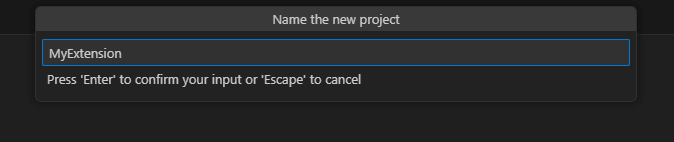
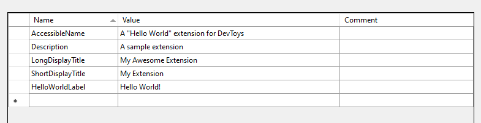
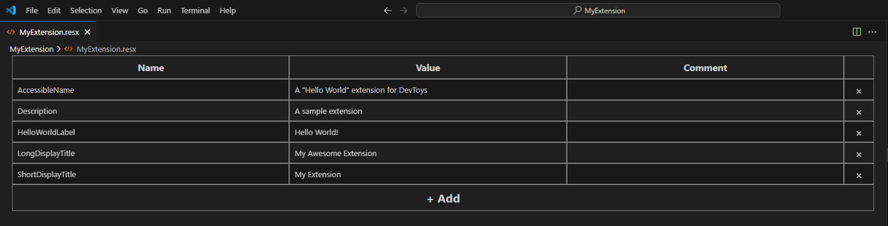
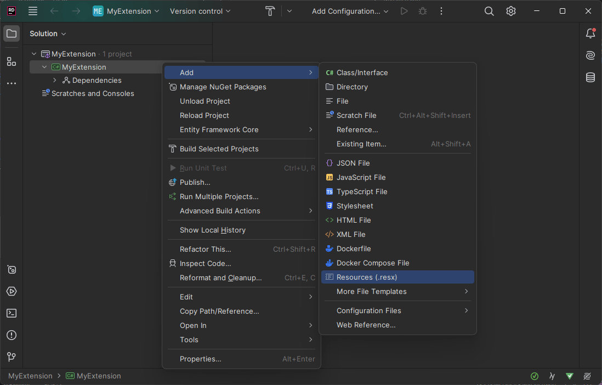
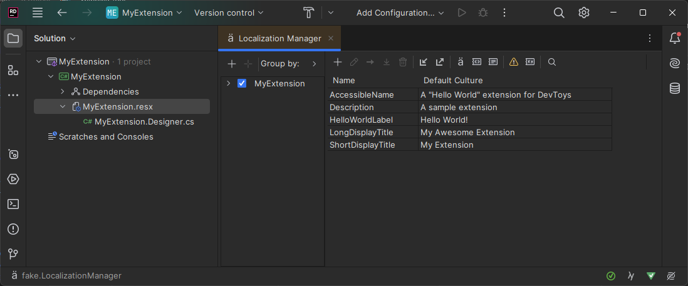

# Create a minimal extension

An extension project for DevToys is essentially a .NET Class Library. It can be used seamlessly with **Visual Studio**, **Visual Studio Code** and **JetBrains Rider**.

This guide will walk you through the process of creating and configuring a DevToys extension project using these editors.

## Create a Class Library

## [**Visual Studio**](#tab/vs)

To create a Class Library project with Visual Studio 2022:

1. Create a new project, from Visual Studio's **Start Page** or by pressing `Ctrl+Shift+N` on the main window, and select the **Class Library** template.
    
1. Assign a name and location for your project.
1. Choose **.NET 8.0** or later, and click **Create**.
    

## [**Visual Studio Code**](#tab/vscode)

To create a Class Library project with Visual Studio Code:

1. In Visual Studio Code, **Open Folder** to where your future project will be.
1. If not installed yet, please install the [**C# DevKit**](https://marketplace.visualstudio.com/items?itemName=ms-dotnettools.csdevkit) and [**ResX Editor**](https://marketplace.visualstudio.com/items?itemName=DominicVonk.vscode-resx-editor) extensions.
1. In the **Command Palette** (`Ctrl+Shift+P`), search for **.NET: New Project**.
   
1. Select the **Class Library** template.
   
1. Give a name to the project and press `Enter`.
   

## [**JetBrains Rider**](#tab/rider)

To create a Class Library project with JetBrains Rider:

1. In JetBrains Rider's **Welcome** window, click **New Solution**.
1. Select **Class Library** template, give a project name, select Framework **net8.0** and click **Create**.
   

***

## Adding the DevToys.Api NuGet package

The [DevToys.Api](https://www.nuget.org/packages/DevToys.Api/) is installed via [NuGet](https://www.nuget.org/packages/DevToys.Api/).
To add it to your project:
1. Open a command line prompt.
2. Navigate to the directory containing the `*.csproj` file you created is (it is the project file create through the previous steps).
3. Execute the following command:
   ```bash
   dotnet add package DevToys.Api --version VERSION_NUMBER
   ```
   Replace `VERSION_NUMBER` with the version number of your choice. You can find version numbers on the [NuGet](https://www.nuget.org/packages/DevToys.Api/) website.

## Understanding a DevToys extension architecture

A DevToys extension typically consists of a minimum of three components:
- A [.resx](https://learn.microsoft.com/en-us/dotnet/core/extensions/create-resource-files#resources-in-resx-files) file containing localized strings.
- @"DevToys.Api.IResourceAssemblyIdentifier": A component that instructs DevToys on how to locate resource files such as localized strings and fonts.
- @"DevToys.Api.IGuiTool": A DevToys tool definition that includes a UI.

While additional components can be added to extend features like DevToys's Smart Detection or to create a command-line tool, this tutorial will focus on the basics. In the following sections, we will implement a minimal DevToys tool with a UI and explain how to create and implement each of the components mentioned above.

## Create a **.resx** file

A RESX file is an XML-based resource file for .NET, typically containing localized strings displayed to the user. For this sample extension, we will create a resource file with the following entries:
- **ShortDisplayTitle**: The tool's title, displayed in the DevToys sidebar.
- **LongDisplayTtite**: The tool's title, displayed at the top of the screen when the user navigates to the tool.
- **AccessibleName**: A descriptive name of the tool, useful for users who rely on assistive technology such as screen readers.
- **Description**: A brief description of the tool, displayed in the grid of tools on the DevToys main page.
- **HelloWorldLabel**: A “hello world” text to be displayed in the tool's UI.

## [**Visual Studio**](#tab/vs)

To create a RESX file with Visual Studio 2022:

1. In the **Solution Explorer**, press `Ctrl+Shift+A` and create a file with the `.resx` extension.
   
1. Add the following entries, and save:
   

## [**Visual Studio Code**](#tab/vscode)

To create a RESX file with Visual Studio Code:

1. In Visual Studio Code, add a **New File** to your project folder with the extension `.resx`. For example `MyExtension.resx`.
1. Add the following entries to it, and save:
   
1. Add a New File named `MyExtension.Designer.cs` and add the following code to it:
   ```csharp
   namespace MyExtension;
   using System;

   internal class MyExtension {

       private static global::System.Resources.ResourceManager resourceMan;

       private static global::System.Globalization.CultureInfo resourceCulture;

       [global::System.Diagnostics.CodeAnalysis.SuppressMessageAttribute("Microsoft.Performance", "CA1811:AvoidUncalledPrivateCode")]
       internal MyExtension() {
       }

       /// <summary>
       ///   Returns the cached ResourceManager instance used by this class.
       /// </summary>
       [global::System.ComponentModel.EditorBrowsableAttribute(global::System.ComponentModel.EditorBrowsableState.Advanced)]
       internal static global::System.Resources.ResourceManager ResourceManager {
           get {
               if (object.ReferenceEquals(resourceMan, null)) {
                   global::System.Resources.ResourceManager temp = new global::System.Resources.ResourceManager("MyExtension.MyExtension", typeof(MyExtension).Assembly);
                   resourceMan = temp;
               }
               return resourceMan;
           }
       }

       /// <summary>
       ///   Overrides the current thread's CurrentUICulture property for all
       ///   resource lookups using this strongly typed resource class.
       /// </summary>
       [global::System.ComponentModel.EditorBrowsableAttribute(global::System.ComponentModel.EditorBrowsableState.Advanced)]
       internal static global::System.Globalization.CultureInfo Culture {
           get {
               return resourceCulture;
           }
           set {
               resourceCulture = value;
           }
       }

       /// <summary>
       ///   Looks up a localized string similar to A &quot;Hello World&quot; extension for DevToys.
       /// </summary>
       internal static string AccessibleName {
           get {
               return ResourceManager.GetString("AccessibleName", resourceCulture);
           }
       }

       /// <summary>
       ///   Looks up a localized string similar to A sample extension.
       /// </summary>
       internal static string Description {
           get {
               return ResourceManager.GetString("Description", resourceCulture);
           }
       }

       /// <summary>
       ///   Looks up a localized string similar to Hello World!.
       /// </summary>
       internal static string HelloWorldLabel {
           get {
               return ResourceManager.GetString("HelloWorldLabel", resourceCulture);
           }
       }

       /// <summary>
       ///   Looks up a localized string similar to My Awesome Extension.
       /// </summary>
       internal static string LongDisplayTitle {
           get {
               return ResourceManager.GetString("LongDisplayTitle", resourceCulture);
           }
       }

       /// <summary>
       ///   Looks up a localized string similar to My Extension.
       /// </summary>
       internal static string ShortDisplayTitle {
           get {
               return ResourceManager.GetString("ShortDisplayTitle", resourceCulture);
           }
       }
   }
   ```
1. Open the `.csproj` file corresponding to your project, add the following to it and save:
   ```xml
   <ItemGroup>
     <EmbeddedResource Update="MyExtension.resx">
       <Generator>ResXFileCodeGenerator</Generator>
       <LastGenOutput>MyExtension.Designer.cs</LastGenOutput>
     </EmbeddedResource>
   </ItemGroup>
   ```

## [**JetBrains Rider**](#tab/rider)

To create a RESX file with JetBrains Rider:

1. In the **Explorer**, do a right-click on the project node, and select **Add > Resources (.resx)**.
   
1. Add the following entries, and save:
   

***

## Create a Resource Assembly Identifier

In the project your created earlier, create a new C# document.
Add the following code:

```csharp
using DevToys.Api;
using System.ComponentModel.Composition;

namespace MyExtension;

[Export(typeof(IResourceAssemblyIdentifier))]
[Name(nameof(MyResourceAssemblyIdentifier))]
internal sealed class MyResourceAssemblyIdentifier : IResourceAssemblyIdentifier
{
    public ValueTask<FontDefinition[]> GetFontDefinitionsAsync()
    {
        throw new NotImplementedException();
    }
}
```

This class will be used by DevToys to identify the assembly containing the resource file with localized strings.
The `Export` attribute is part of the .NET [Managed Extensibility Framework (MEF)](https://learn.microsoft.com/en-us/dotnet/framework/mef/). This is an important part of DevToys extensibility. It has a significant impact on how an extenion should be published. We will explore how in a later section.

## Create a tool with a UI

Add a new C# document to the project and add the following code:

```csharp
using DevToys.Api;
using System.ComponentModel.Composition;
using static DevToys.Api.GUI;

namespace MyExtension;

[Export(typeof(IGuiTool))]
[Name("MyExtension")]                                                         // A unique, internal name of the tool.
[ToolDisplayInformation(
    IconFontName = "FluentSystemIcons",                                       // This font is available by default in DevToys
    IconGlyph = '\uE670',                                                     // An icon that represents a pizza
    GroupName = PredefinedCommonToolGroupNames.Converters,                    // The group in which the tool will appear in the side bar.
    ResourceManagerAssemblyIdentifier = nameof(MyResourceAssemblyIdentifier), // The Resource Assembly Identifier to use
    ResourceManagerBaseName = "MyExtension.MyExtension",                      // The full name (including namespace) of the resource file containing our localized texts
    ShortDisplayTitleResourceName = nameof(MyExtension.ShortDisplayTitle),    // The name of the resource to use for the short display title
    LongDisplayTitleResourceName = nameof(MyExtension.LongDisplayTitle),
    DescriptionResourceName = nameof(MyExtension.Description),
    AccessibleNameResourceName = nameof(MyExtension.AccessibleName))]
internal sealed class MyExtensionGui : IGuiTool
{
    public UIToolView View => new(Label().Style(UILabelStyle.BodyStrong).Text(MyExtension.HelloWorldLabel));

    public void OnDataReceived(string dataTypeName, object? parsedData)
    {
        throw new NotImplementedException();
    }
}
```

That's it! In the next section, we will cover how to build and debug this extension.