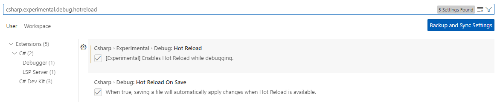
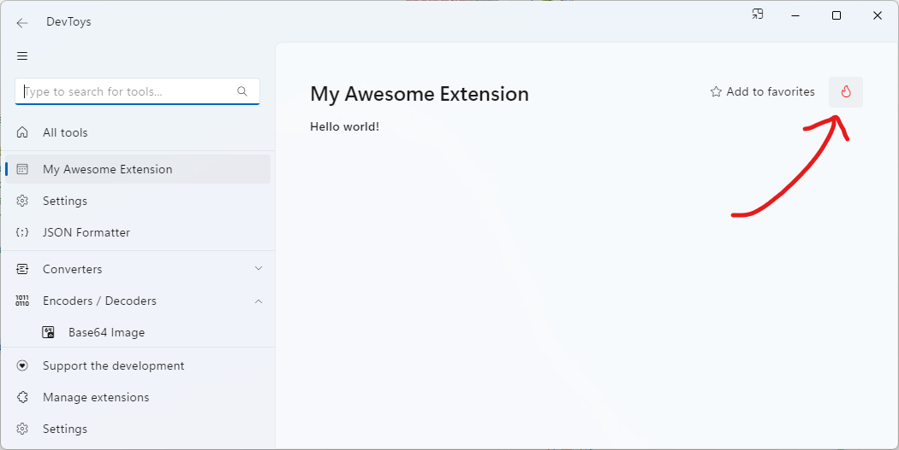

# Debug an extension

Building and debugging a DevToys extension is a straightforward process. This guide will walk you through the necessary steps.

## One-time configuration

Before you can debug your extension, there’s a one-time configuration you need to complete:

1. In the project your created, add a new folder named **Properties**.
1. In the **Properties** folder, create a new file named **launchSettings.json**.
1. Paste the following JSON into this file:
   ```json
    {
      "$schema": "https://json.schemastore.org/launchsettings.json",
      "profiles": {
        "DevToys GUI": {
          "commandName": "Executable",
          "executablePath": "%DevToysGuiDebugEntryPoint%",
          "environmentVariables": {
            "EXTRAPLUGIN": "$(TargetDir)"
          }
        },
        "DevToys CLI": {
          "commandName": "Executable",
          "executablePath": "%DevToysCliDebugEntryPoint%",
          "commandLineArgs": "",
          "environmentVariables": {
            "EXTRAPLUGIN": "$(TargetDir)"
          }
        }
      }
    }
   ```

Assuming you've correctly set the `DevToysGuiDebugEntryPoint` and `DevToysCliDebugEntryPoint` environment variable as per the [Setup](setup.md) steps, this JSON configuration will enable automatic startup of **DevToys** or **DevToys CLI** and pass your extension as an argument.

## Build & Run

Now comes the exciting part! Once the above steps are completed, you should be able to press `F5` in your editor (whether it’s **Visual Studio**, **Visual Studio Code**, or **JetBrains Rider**) to start the debugger. Your project will build, then DevToys will start, and your extension will be loaded. The **My Extension** tool should be available in the list of tools. You can place a breakpoint in the extension, such as in the `GetFontDefinitionsAsync` method or `View` property, and your editor should pause the execution when invoked.

To debug a [command line tool](../guidelines/command-line-tool.md), use the `DevToys CLI` startup configuration. Change the `commandLineArgs` in your **launchSettings.json** to invoke the command and options you created.

### Hot Reload

[Hot Reload](https://devblogs.microsoft.com/dotnet/introducing-net-hot-reload/) feature is supported in DevToys.

#### [**Visual Studio**](#tab/vs)

Hot Reload is enabled by default in **Visual Studio 2022**. In case, you can navigate to the menu `Tools > Options` and search for **Hot Reload** and verify whether the option is enabled.

#### [**Visual Studio Code**](#tab/vscode)

Hot Reload is an experimental feature of [**C# DevKit**](https://marketplace.visualstudio.com/items?itemName=ms-dotnettools.csdevkit) extension in **Visual Studio Code**.

To enable it:
1. If not installed yet, please install the [**C# DevKit**](https://marketplace.visualstudio.com/items?itemName=ms-dotnettools.csdevkit).
1. Enabled the option **csharp.experimental.debug.hotreload** in **User settings** (under `File > Preferences > Settings`).
   

#### [**JetBrains Rider**](#tab/rider)

Hot Reload is enabled by default in **JetBrains Rider**. In case, you can navigate to the menu `File > Settings` and search for **Hot Reload** and verify whether the option is enabled.

***

Once Hot Reload is enabled in your editor, you will be able to edit your extension while debugging it and see the changes in live in DevToys.

#### General limitation

- Code changes will only be applied while actively debugging.
- Changes made to the user interface of a DevToys tool only applies when clicking the **Hot Reload** button in DevToys. This button ultimately unload the displayed UI and reload it from the updated code. This button only appears while DevToys is debugged.
  