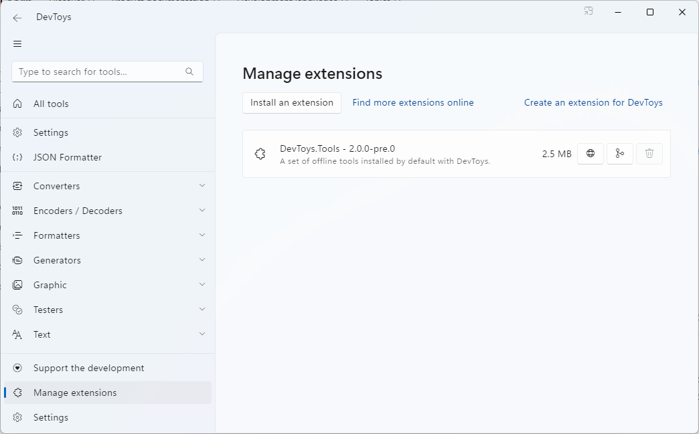

# Publish

Have you developed an extension for DevToys and are ready to share it with the world? That’s fantastic! Publishing your extension is both simple and free.

## Considerations when Release build

DevToys’ extensibility is made possible through the [Managed Extensibility Framework (MEF)](https://learn.microsoft.com/en-us/dotnet/framework/mef/). MEF is excellent for desktop applications as it enables an app to dynamically load any .NET class library that implements specific interfaces used by DevToys for extensibility, without the main DevToys app needing prior knowledge of your extension.

However, this flexibility comes with a significant caveat. Extensions are discovered through [Reflection](https://learn.microsoft.com/en-us/dotnet/framework/reflection-and-codedom/reflection), which has implications for Release builds:
1. Exercise caution when using [trimming](https://learn.microsoft.com/en-us/dotnet/core/deploying/trimming/fixing-warnings), as Reflection can be affected by it.
1. [Native AOT](https://learn.microsoft.com/en-us/dotnet/core/deploying/native-aot/) can introduce a lot of complications. It can modify your Class Library such that DevToys won’t locate your components via Reflection. You’ll also need to compile and release a distinct binary file for each platform you aim to target (Windows, macOS, Linux).

Unless there’s a compelling reason to use AOT and trimming, we advise against using trimming and AOT when building an extensions for DevToys in Release mode.

## Packing an extension

DevToys extensions should be packaged as [NuGet package](https://learn.microsoft.com/en-us/nuget/what-is-nuget). When installing an extension through the **Manage extensions** page in DevToys, the app unpacks the NuGet package and stores it in a directory. DevToys uses the **.nuspec** file of the NuGet package (a file containing declarative package information) to display details about the extension in the extension manager, such as its title, description, and version number.

As of DevToys 2.0 preview, the app does not automatically verify whether a new version of the extension is available, but this feature may be supported soon.



To create an extension package, start by editing the `*.csproj` file you created in the previous steps and add the following:
```xml
<Project Sdk="Microsoft.NET.Sdk">
  <PropertyGroup>
    <!-- NuGet package -->
    <IsPackable>true</IsPackable>
    <Version>1.0.0</Version>
    <Title>MyExtension</Title>
    <Description>A description of my extension.</Description>
    <PackageProjectUrl>https://my-website.com</PackageProjectUrl>
    <RepositoryUrl>https://github.com/user/repository</RepositoryUrl>
    <Authors>my name</Authors>
    <PackageTags>devtoys-app</PackageTags>
  </PropertyGroup>

  <!-- This makes sure to include dependencies of the project into the NuGet package -->
  <Target Name="IncludeAllFilesInTargetDir" BeforeTargets="_GetPackageFiles">
    <ItemGroup>
      <None Include="$(OutputPath)\**">
        <Pack>true</Pack>
        <PackagePath>lib\net8.0</PackagePath>
      </None>
    </ItemGroup>
  </Target>
</Project>
```

These project properties will allow the creation of the nuspec file automatically. You can then use the [dotnet pack](https://learn.microsoft.com/en-us/dotnet/core/tools/dotnet-pack) command to generate a `.nupkg` file, which is a NuGet Package.

## Publishing an extension

There are several ways to share your extension online. Here are a few recommendations:
- Publish it on [nuget.org](https://nuget.org) for free. We recommend using the tag `devtoys-app`, where we aim to centralize most extensions for DevToys, making them easier to discover.
- Publish it on [a private NuGet feed](https://learn.microsoft.com/en-us/nuget/hosting-packages/overview). This can be beneficial if you want to share your extension internally within an organization.
- Publish it on [GitHub](https://github.com/) for free, especially if your extension is open-source.
- Publish it on your own website.