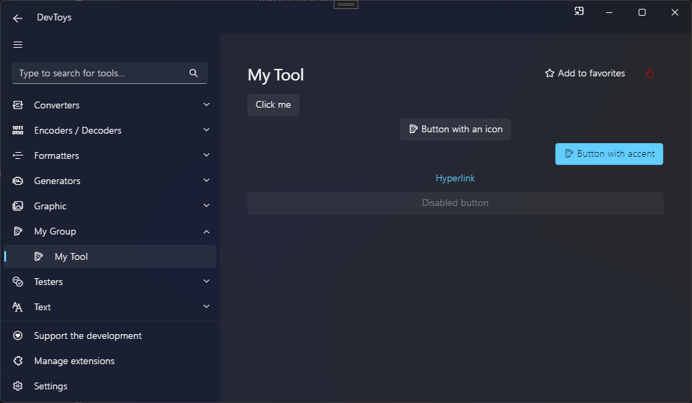

# Button

You can create a button using the @"DevToys.Api.GUI.Button" static method, which produces a @"DevToys.Api.IUIButton".

## Sample

```csharp
using DevToys.Api;
using System.ComponentModel.Composition;
using static DevToys.Api.GUI;

namespace MyProject;

[Export(typeof(IGuiTool))]
[Name("My Tool")]
[ToolDisplayInformation(
    IconFontName = "FluentSystemIcons",
    IconGlyph = '\uE670',
    ResourceManagerAssemblyIdentifier = nameof(MyResourceAssemblyIdentifier),
    ResourceManagerBaseName = "MyProject.Strings",
    ShortDisplayTitleResourceName = nameof(Strings.ShortDisplayTitle),
    DescriptionResourceName = nameof(Strings.Description),
    GroupName = "My Group")]
internal sealed class MyGuiTool : IGuiTool
{
    private readonly IUIButton _button = Button();

    public UIToolView View
        => new UIToolView(
            Stack()
                .Vertical()
                .WithChildren(
                    _button
                        .Text("Click me")
                        .OnClick(OnButtonClick),
                    Button()
                        .AccentAppearance()
                        .Icon("FluentSystemIcons", '\uE670')
                        .Text("Button with accent and icon"),
                    Button()
                        .HyperlinkAppearance()
                        .Text("Hyperlink"),
                    Button()
                        .Text("Disabled button")
                        .Disable()));

    public void OnDataReceived(string dataTypeName, object? parsedData)
    {
        // Handle Smart Detection.
    }

    private void OnButtonClick()
    {
        _button.Text("Clicked !");
    }
}
```

The code above produces the following UI:

