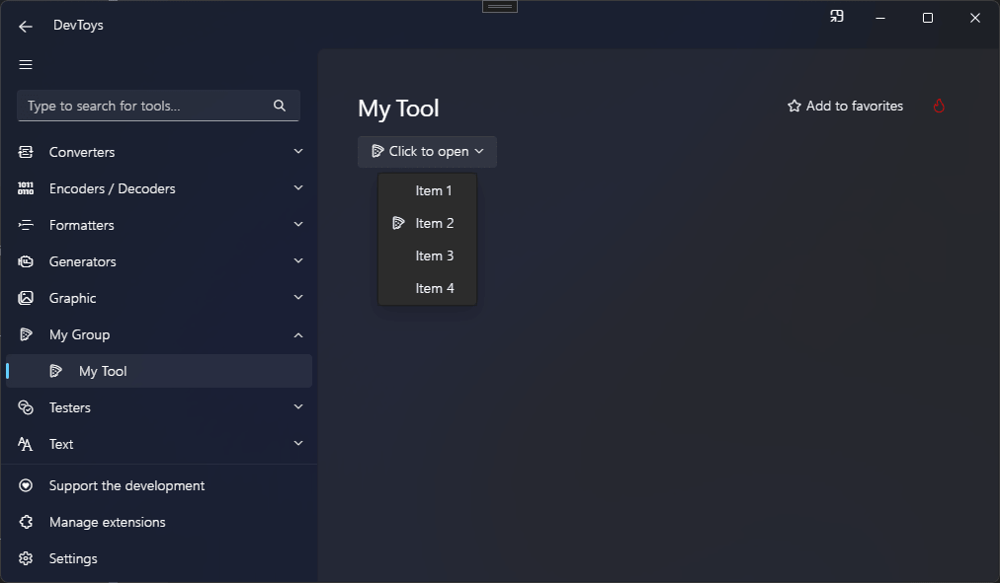

# Drop Down Button

You can create a drop down button using the @"DevToys.Api.GUI.DropDownButton" static method, which produces a @"DevToys.Api.IUIDropDownButton".

## Sample

```csharp
using DevToys.Api;
using System.ComponentModel.Composition;
using static DevToys.Api.GUI;

namespace MyProject;

[Export(typeof(IGuiTool))]
[Name("My Tool")]
[ToolDisplayInformation(
    IconFontName = "FluentSystemIcons",
    IconGlyph = '\uE670',
    ResourceManagerAssemblyIdentifier = nameof(MyResourceAssemblyIdentifier),
    ResourceManagerBaseName = "MyProject.Strings",
    ShortDisplayTitleResourceName = nameof(Strings.ShortDisplayTitle),
    DescriptionResourceName = nameof(Strings.Description),
    GroupName = "My Group")]
internal sealed class MyGuiTool : IGuiTool
{
    public UIToolView View
        => new UIToolView(
            DropDownButton()
                .AlignHorizontally(UIHorizontalAlignment.Left)
                .Icon("FluentSystemIcons", '\uE670')
                .Text("Click to open")
                .WithMenuItems(
                    DropDownMenuItem("Item 1"),
                    DropDownMenuItem()
                        .Text("Item 2")
                        .Icon("FluentSystemIcons", '\uE670'),
                    DropDownMenuItem()
                        .Text("Item 3")
                        .OnClick(OnDropDownMenuItemClick),
                    DropDownMenuItem("Item 4")));

    public void OnDataReceived(string dataTypeName, object? parsedData)
    {
        // Handle Smart Detection.
    }

    private void OnDropDownMenuItemClick()
    {
    }
}
```

The code above produces the following UI:

