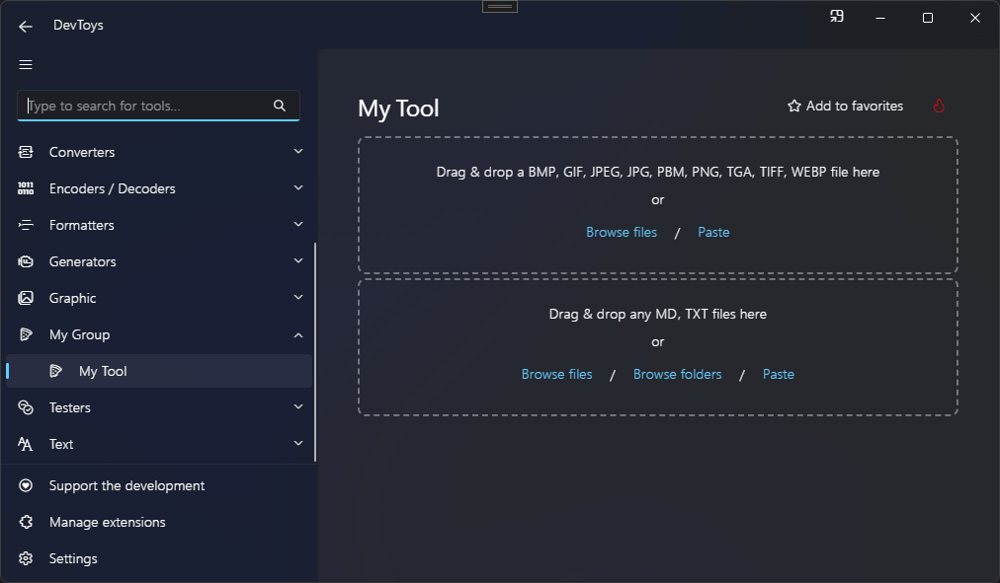

# File Selector

You can invite a user to select one or many files using the @"DevToys.Api.GUI.FileSelector" static method, which produces a @"DevToys.Api.IUIFileSelector".

## Sample

```csharp
using DevToys.Api;
using System.ComponentModel.Composition;
using static DevToys.Api.GUI;

namespace MyProject;

[Export(typeof(IGuiTool))]
[Name("My Tool")]
[ToolDisplayInformation(
    IconFontName = "FluentSystemIcons",
    IconGlyph = '\uE670',
    ResourceManagerAssemblyIdentifier = nameof(MyResourceAssemblyIdentifier),
    ResourceManagerBaseName = "MyProject.Strings",
    ShortDisplayTitleResourceName = nameof(Strings.ShortDisplayTitle),
    DescriptionResourceName = nameof(Strings.Description),
    GroupName = "My Group")]
internal sealed class MyGuiTool : IGuiTool
{
    public UIToolView View
        => new UIToolView(
            Stack()
                .Vertical()
                .WithChildren(
                    // Select a single image file.
                    FileSelector()
                        .CanSelectOneFile()
                        .LimitFileTypesToImages(),
                    // Select one or many text files.
                    FileSelector()
                        .CanSelectManyFiles()
                        .LimitFileTypesTo(".txt", ".md")
                        .OnFilesSelected(OnFilesSelected)));

    public void OnDataReceived(string dataTypeName, object? parsedData)
    {
        // Handle Smart Detection.
    }

    private void OnFilesSelected(SandboxedFileReader[] files)
    {
        // Handle the selected files.
        // [...]
        for (int i = 0; i < files.Length; i++)
        {
            files[i].Dispose();
        }
    }
}
```

For more information on what is @"DevToys.Api.SandboxedFileReader", see [use files](../../use-files.md).

The code above produces the following UI:

