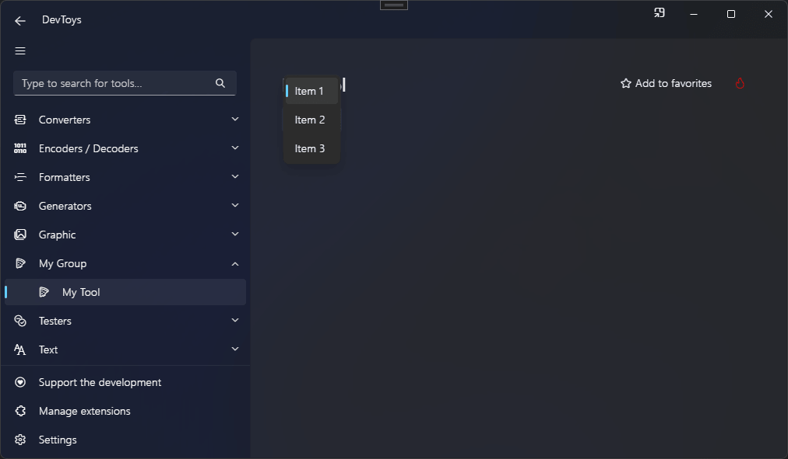

# Select Drop Down List

You can create a select drop down list (aka. combo box) using the @"DevToys.Api.GUI.SelectDropDownList" static method, which produces a @"DevToys.Api.IUISelectDropDownList".

## Sample

```csharp
using DevToys.Api;
using System.ComponentModel.Composition;
using static DevToys.Api.GUI;

namespace MyProject;

[Export(typeof(IGuiTool))]
[Name("My Tool")]
[ToolDisplayInformation(
    IconFontName = "FluentSystemIcons",
    IconGlyph = '\uE670',
    ResourceManagerAssemblyIdentifier = nameof(MyResourceAssemblyIdentifier),
    ResourceManagerBaseName = "MyProject.Strings",
    ShortDisplayTitleResourceName = nameof(Strings.ShortDisplayTitle),
    DescriptionResourceName = nameof(Strings.Description),
    GroupName = "My Group")]
internal sealed class MyGuiTool : IGuiTool
{
    public UIToolView View
        => new UIToolView(
            SelectDropDownList()
                .AlignHorizontally(UIHorizontalAlignment.Left)
                .WithItems(
                    Item(text: "Item 1", value: new object() /* Any value */),
                    Item(text: "Item 2", value: true),
                    Item(text: "Item 3", value: 123))
                .Select(0)
                .OnItemSelected(OnItemSelected));

    public void OnDataReceived(string dataTypeName, object? parsedData)
    {
        // Handle Smart Detection.
    }

    private void OnItemSelected(IUIDropDownListItem? selectedItem)
    {
    }
}
```

The code above produces the following UI:

