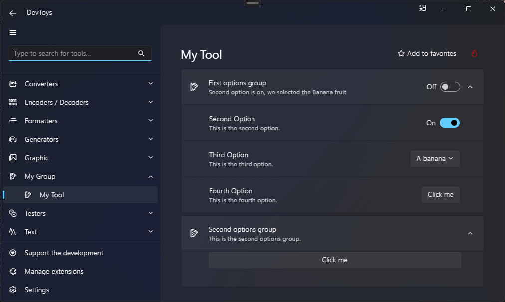

# Setting & Setting group

DevToys has an API to support settings. Settings are often simple values that are persisted on the hard drive so DevToys can restore their state after restarting. See [Use settings](../../use-settings.md) for more information.

You can display a setting [card](../layout/card.md) using the @"DevToys.Api.GUI.Setting" or @"DevToys.Api.GUI.SettingGroup" static methods, which produces a @"DevToys.Api.IUISetting" or @"DevToys.Api.IUISettingGroup". Each of these controls can handle settings automatically, simplifying the support of @System.Boolean and @System.Enum settings.

The main difference between these two UI element is that a `SettingGroup` is expandable, can display children `Setting`, and can display a summary of the state of the children settings thanks to @"DevToys.Api.IUISetting.StateDescription".

Both `SettingGroup` and `Setting` component can handle settings automatically using their `Handle` extension methods.

## Sample

```csharp
using DevToys.Api;
using System.ComponentModel.Composition;
using static DevToys.Api.GUI;

namespace MyProject;

[Export(typeof(IGuiTool))]
[Name("My Tool")]
[ToolDisplayInformation(
    IconFontName = "FluentSystemIcons",
    IconGlyph = '\uE670',
    ResourceManagerAssemblyIdentifier = nameof(MyResourceAssemblyIdentifier),
    ResourceManagerBaseName = "MyProject.Strings",
    ShortDisplayTitleResourceName = nameof(Strings.ShortDisplayTitle),
    DescriptionResourceName = nameof(Strings.Description),
    GroupName = "My Group")]
internal sealed class MyGuiTool : IGuiTool
{
    private static readonly SettingDefinition<bool> firstOption
        = new(
            name: $"{nameof(MyGuiTool)}.{nameof(firstOption)}",
            defaultValue: false);

    private static readonly SettingDefinition<bool> secondOption
        = new(
            name: $"{nameof(MyGuiTool)}.{nameof(secondOption)}",
            defaultValue: true);

    private enum Fruit
    {
        Banana,
        Strawberry,
        Apple
    }

    private static readonly SettingDefinition<Fruit> thirdOption
        = new(
            name: $"{nameof(MyGuiTool)}.{nameof(thirdOption)}",
            defaultValue: Fruit.Banana);

    [Import]
    private ISettingsProvider _settingsProvider = null!;

    private readonly IUISetting _thirdOptionUISetting = Setting();

    public UIToolView View
        => new UIToolView(
            Stack()
                .Vertical()
                .WithChildren(
                    SettingGroup()
                        .Title("First options group")
                        .Handle(_settingsProvider, firstOption, OnFirstOptionChanged) // This will automatically display a Toggle Switch because `firstOption` is a boolean option.
                        .Icon("FluentSystemIcons", '\uE670')
                        .WithSettings(

                            Setting()
                                .Title("Second Option")
                                .Description("This is the second option.")
                                .Handle(
                                    _settingsProvider,
                                    secondOption, // This will automatically display a Toggle Switch because `secondOption` is a boolean option.
                                    stateDescriptionWhenOn: "Second option is on",
                                    stateDescriptionWhenOff: "Second option is off",
                                    OnSecondOptionChanged),

                            _thirdOptionUISetting
                                .Title("Third Option")
                                .Description("This is the third option.")
                                .Handle(
                                    _settingsProvider,
                                    thirdOption, // This will automatically display a Select Drop Down List because `thirdOption` is an enumeration option.
                                    OnThirdOptionChanged,
                                    Item("A banana", Fruit.Banana),
                                    Item("A strawberry", Fruit.Strawberry),
                                    Item("An apple", Fruit.Apple)),
                            
                            Setting()
                                .Title("Fourth Option")
                                .Description("This is the fourth option.")
                                .InteractiveElement( // Here, we do not handle a setting automatically. Instead, we display a custom UI element.
                                    Button().Text("Click me"))),

                    SettingGroup()
                        .Title("Second options group")
                        .Description("This is the second options group.")
                        .Icon("FluentSystemIcons", '\uE670')
                        .WithChildren( // Here, we use `WithChildren` instead of `WithSettings`, which allows us to display any kind of UI element.
                            Button().Text("Click me"))));

    public void OnDataReceived(string dataTypeName, object? parsedData)
    {
        // Handle Smart Detection.
    }

    private void OnFirstOptionChanged(bool isOn)
    {
    }

    private void OnSecondOptionChanged(bool isOn)
    {
    }

    private void OnThirdOptionChanged(Fruit optionValue)
    {
        _thirdOptionUISetting.StateDescription($"we selected the {optionValue} fruit");
    }
}
```

The code above produces the following UI:

