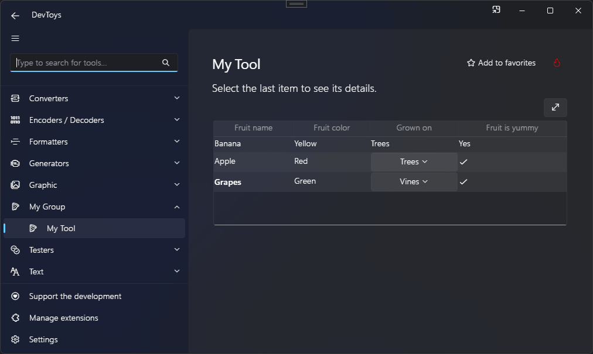

# Data Grid

You can create a data grid using the @"DevToys.Api.GUI.DataGrid" static method, which produces a @"DevToys.Api.IUIDataGrid".

## Sample

```csharp
using DevToys.Api;
using System.ComponentModel.Composition;
using static DevToys.Api.GUI;

namespace MyProject;

[Export(typeof(IGuiTool))]
[Name("My Tool")]
[ToolDisplayInformation(
    IconFontName = "FluentSystemIcons",
    IconGlyph = '\uE670',
    ResourceManagerAssemblyIdentifier = nameof(MyResourceAssemblyIdentifier),
    ResourceManagerBaseName = "MyProject.Strings",
    ShortDisplayTitleResourceName = nameof(Strings.ShortDisplayTitle),
    DescriptionResourceName = nameof(Strings.Description),
    GroupName = "My Group")]
internal sealed class MyGuiTool : IGuiTool
{
    public UIToolView View
        => new UIToolView(
            Stack()
                .Vertical()
                .WithChildren(
                    Label().Style(UILabelStyle.BodyLarge).Text("Select the last item to see its details."),
                    DataGrid()
                        .Extendable()
                        .AllowSelectItem()
                        .OnRowSelected(OnSelectionChanged)
                        .WithColumns("Fruit name", "Fruit color", "Grown on", "Fruit is yummy")
                        .WithRows(

                            Row(
                                value: null /* Any value */,
                                "Banana",
                                "Yellow",
                                "Trees",
                                "Yes"),

                            Row(
                                value: null /* Any value */,
                                Cell("Apple"),
                                Cell("Red"),
                                Cell(
                                    SelectDropDownList()
                                        .WithItems(
                                            Item("Trees"),
                                            Item("Vines"))
                                        .Select(0)),
                                Cell(Icon("FluentSystemIcons", '\uE305'))),

                            Row(
                                value: null /* Any value */,
                                details:
                                    Label()
                                        .Style(UILabelStyle.Caption)
                                        .Text("Grapes are my favorites!"),
                                Cell(
                                    Label()
                                        .Style(UILabelStyle.BodyStrong)
                                        .Text("Grapes")),
                                Cell("Green"),
                                Cell(
                                    SelectDropDownList()
                                        .WithItems(
                                            Item("Trees"),
                                            Item("Vines"))
                                        .Select(1)),
                                Cell(
                                    Icon("FluentSystemIcons", '\uE305'))))));

    public void OnDataReceived(string dataTypeName, object? parsedData)
    {
        // Handle Smart Detection.
    }

    private void OnSelectionChanged(IUIDataGridRow? selectedRow)
    {
    }
}
```

The code above produces the following UI:

