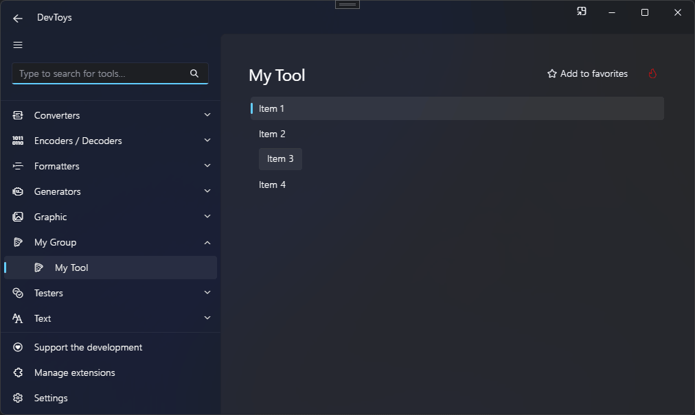

# List

You can create a list of selectable items using the @"DevToys.Api.GUI.List" static method, which produces a @"DevToys.Api.IUIList".

## Sample

```csharp
using DevToys.Api;
using System.ComponentModel.Composition;
using static DevToys.Api.GUI;

namespace MyProject;

[Export(typeof(IGuiTool))]
[Name("My Tool")]
[ToolDisplayInformation(
    IconFontName = "FluentSystemIcons",
    IconGlyph = '\uE670',
    ResourceManagerAssemblyIdentifier = nameof(MyResourceAssemblyIdentifier),
    ResourceManagerBaseName = "MyProject.Strings",
    ShortDisplayTitleResourceName = nameof(Strings.ShortDisplayTitle),
    DescriptionResourceName = nameof(Strings.Description),
    GroupName = "My Group")]
internal sealed class MyGuiTool : IGuiTool
{
    public UIToolView View
        => new UIToolView(
            List()
                .WithItems(
                    Item(
                        uiElement: Label().Text("Item 1"),
                        value: null /* Any value */),
                    Item(
                        uiElement: Label().Text("Item 2"),
                        value: null /* Any value */),
                    Item(
                        uiElement: Button().Text("Item 3"),
                        value: null /* Any value */),
                    Item(
                        uiElement: Label().Text("Item 4"),
                        value: null /* Any value */))
                .Select(0)
                .OnItemSelected(OnSelectionChanged));

    public void OnDataReceived(string dataTypeName, object? parsedData)
    {
        // Handle Smart Detection.
    }

    private void OnSelectionChanged(IUIListItem? selectedItem)
    {
    }
}
```

The code above produces the following UI:

