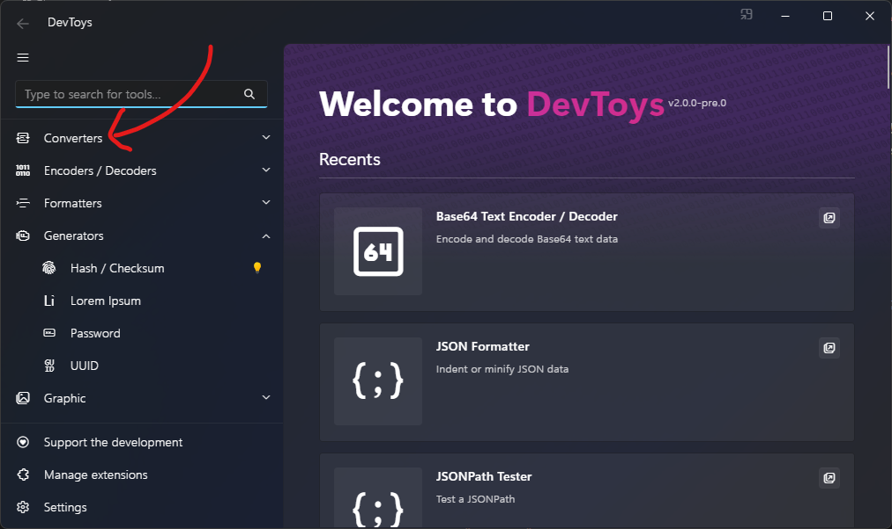

# Create a group

In DevToys, tools are often part of a group. Group are displayed in the navigation bar.



## Predefined groups

A set of pre-defined groups are available in @"DevToys.Api.PredefinedCommonToolGroupNames".

## Define a Gui Tool Group

To define a new group, you can implement @"DevToys.Api.GuiToolGroup" and expose it to [MEF](https://learn.microsoft.com/en-us/dotnet/framework/mef/) using @"System.ComponentModel.Composition.ExportAttribute" attribute.

```csharp
using DevToys.Api;
using System.ComponentModel.Composition;

namespace MyProject;

[Export(typeof(GuiToolGroup))]
[Name("My Group")]
[Order(After = PredefinedCommonToolGroupNames.Converters)]
internal class MyGroup : GuiToolGroup
{
    [ImportingConstructor]
    internal MyGroup()
    {
        IconFontName = "FluentSystemIcons";
        IconGlyph = '\uE670';
        DisplayTitle = MyProject.Strings.MyGroupDisplayTitle;
        AccessibleName = MyProject.Strings.MyGroupAccessibleName;
    }
}
```

The @"DevToys.Api.NameAttribute" is required and its value should be an unique name that stays internal. This name may appear in logs as it can help for debugging purposes. It is also used to associate a tool to a group.

Four properties can be set into the group:
- **IconFontName**: Name of the font the contains the glyph to display in the navigation bar. The font name should be installed on the operating system, or [being shipped with the tool](create-custom-icon.md). The font [FluentSystemIcons](https://github.com/microsoft/fluentui-system-icons) is shipped with DevToys 2.0 and therefore is available to every extensions by default, on every operating systems.
- **IconGlyph**: The character of the font for the tool icon to use in the navigation bar.
- **DisplayTitle**: A localized text to display in the navigation bar.
- **AccessibleName**: (Optional) A localized text to use as a descriptive name of the group, useful for users who rely on assistive technology such as screen readers.

Some other optional attributes can be used to personalize how the tool behaves:
- @"DevToys.Api.OrderAttribute": Defines how this tool should be ordered in the list of groups compared to another one. The **Before** and **After** properties should be equal to the @"DevToys.Api.NameAttribute" of other groups.