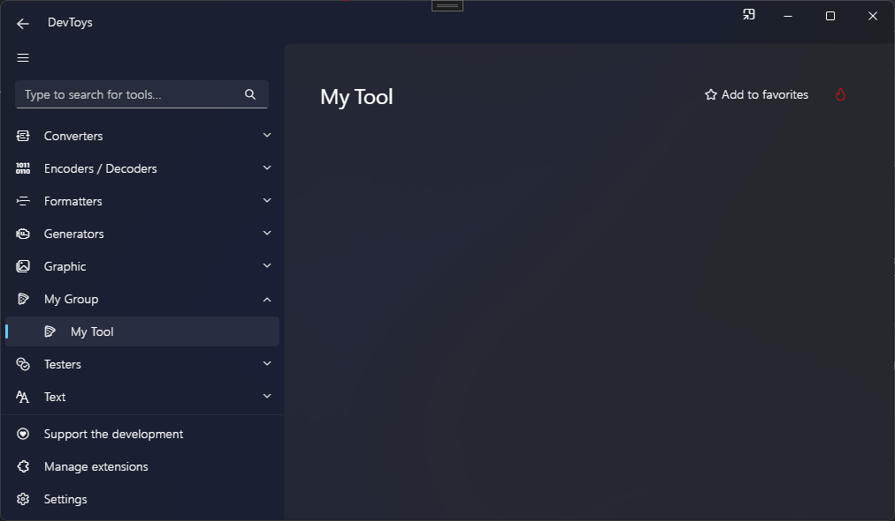

# Create a tool with a GUI

## Overview

DevToys 2.0 allows you to create your own tool with a GUI. A dedicated UI API is part of `DevToys.Api`.

Creating a user interface within a DevToys tool is a straightforward process. Despite being coded in C#, running natively on the computer, and having access to the entire feature set of the operating system, DevToys' UI is rendered using web technology thanks to [Blazor Hybrid](https://learn.microsoft.com/en-us/aspnet/core/blazor/hybrid).

>[!NOTE]
>On **Windows**, the UI is rendered with the built-in [Microsoft Edge WebView2](https://learn.microsoft.com/en-us/microsoft-edge/webview2/), based on [Chromium](https://www.chromium.org/Home/). On **macOS** and **Linux**, the UI is rendered with the built-in [WebKit](https://webkit.org/).
>DevToys does **_not_** bundle the web engine like Electron apps. Instead, it uses the engine installed on the operated system.

The DevToys UI API is designed such that **_no prior knowledge of web development is required_** to create a visually appealing and consistent user interface for your tool. The UI API provides access to a set of pre-built UI components with minimal customization options, ensuring a coherent and consistent design across all tools in DevToys. This makes it quick and easy to assemble a high-quality UI that is compatible with every platform (Windows, MacOS, Linux).

Let's delve into the process of creating a tool with a UI in DevToys.

## Define a GUI tool

To create a tool with a UI, implement the @"DevToys.Api.IGuiTool" and expose it to [MEF](https://learn.microsoft.com/en-us/dotnet/framework/mef/) using @"System.ComponentModel.Composition.ExportAttribute" attribute.

```csharp
using DevToys.Api;
using System.ComponentModel.Composition;

namespace MyProject;

[Export(typeof(IGuiTool))]
[Name("My Tool")]
[ToolDisplayInformation(
    IconFontName = "FluentSystemIcons",
    IconGlyph = '\uE670',
    ResourceManagerAssemblyIdentifier = nameof(MyResourceAssemblyIdentifier),
    ResourceManagerBaseName = "MyProject.Strings",
    ShortDisplayTitleResourceName = nameof(MyProject.Strings.ShortDisplayTitle),
    LongDisplayTitleResourceName = nameof(MyProject.Strings.LongDisplayTitle),
    DescriptionResourceName = nameof(MyProject.Strings.Description),
    AccessibleNameResourceName = nameof(MyProject.Strings.AccessibleName),
    SearchKeywordsResourceName = nameof(MyProject.Strings.SearchKeywords),
    GroupName = "My Group")]
[TargetPlatform(Platform.Windows)]
[TargetPlatform(Platform.MacOS)]
[Order(Before = "My Other Tool")]
[NoCompactOverlaySupport]
internal sealed class MyGuiTool : IGuiTool
{
    public UIToolView View { get; } // Provide the UI of the tool.

    public void OnDataReceived(string dataTypeName, object? parsedData)
    {
        // Handle Smart Detection.
    }
}
```

The @"DevToys.Api.NameAttribute" is mandatory and should be assigned a unique, internal name. This name may appear in logs and can assist with debugging.

The @"DevToys.Api.ToolDisplayInformationAttribute" is also required and defines multiple information needed for the GUI tool:
- **IconFontName**: Name of the font the contains the glyph to display in the navigation bar. The font name should be installed on the operating system, or [being shipped with the tool](create-custom-icon.md). The font [FluentSystemIcons](https://github.com/microsoft/fluentui-system-icons) is shipped with DevToys 2.0 and therefore is available to every extensions by default, on every operating systems.
- **IconGlyph**: The character of the font for the tool icon to use in the navigation bar.
- **ResourceManagerAssemblyIdentifier**: The internal @"DevToys.Api.NameAttribute" of a @"DevToys.Api.IResourceAssemblyIdentifier". See [Create a custom icon](create-custom-icon.md).
- **ResourceManagerBaseName**: The full name (namespace and class) to the [.resx](https://learn.microsoft.com/en-us/dotnet/core/extensions/create-resource-files#resources-in-resx-files) file containing localized strings for the tool. This parameter assumes the resource file is in the same assembly than the indicated `ResourceManagerAssemblyIdentifier`.
- **ShortDisplayTitleResourceName**: The name of the resource in the resource file pointed by **ResourceManagerBaseName** to use as a short tool name to be display in the navigation bar.
- **LongDisplayTitleResourceName**: (Optional) The name of the resource in the resource file pointed by **ResourceManagerBaseName** to use as a longer tool name to be display in the search bar result or the top of the tool. When not set, the `ShortDisplayTitleResourceName` is used instead.
- **DescriptionResourceName**: (Optional) The name of the resource in the resource file pointed by **ResourceManagerBaseName** to use as a description of the tool to be displayed in the grid of tools on the main page or on a group page.
- **AccessibleNameResourceName**: (Optional) The name of the resource in the resource file pointed by **ResourceManagerBaseName** to use as a descriptive name of the tool, useful for users who rely on assistive technology such as screen readers.
- **SearchKeywordsResourceName**: (Optional) The name of the resource in the resource file pointed by **ResourceManagerBaseName** to use as a set of alternative keywords to use to match the tool when the user search into the search bar. Keywords should be separated by a whitespace.
- **GroupName**: (Optional) The internal @"DevToys.Api.NameAttribute" of a @"DevToys.Api.GuiToolGroup". See [Create a group](create-a-group.md).
  A set of pre-defined groups are available in @"DevToys.Api.PredefinedCommonToolGroupNames"


Some other optional attributes can be used to personalize how the tool behaves:
- @"DevToys.Api.TargetPlatformAttribute": Defines the platform supported by this tool. In the code example above, the tool is only compatible with Windows and MacOS and therefore will not be displayed in the navigation bar on Linux. By default, every platforms are supported. Not using this attribute at all means the tool will be available on every platform.
- @"DevToys.Api.OrderAttribute": Defines how this tool should be ordered in the list of tool compared to another one. The **Before** and **After** properties should be equal to the @"DevToys.Api.NameAttribute" of other tools.
- @"DevToys.Api.NoCompactOverlaySupportAttribute": Indicates that the tool does not support Compact Overlay (aka. Picture-in-Picture) mode.

When debugging, the tool should now look like the following:
