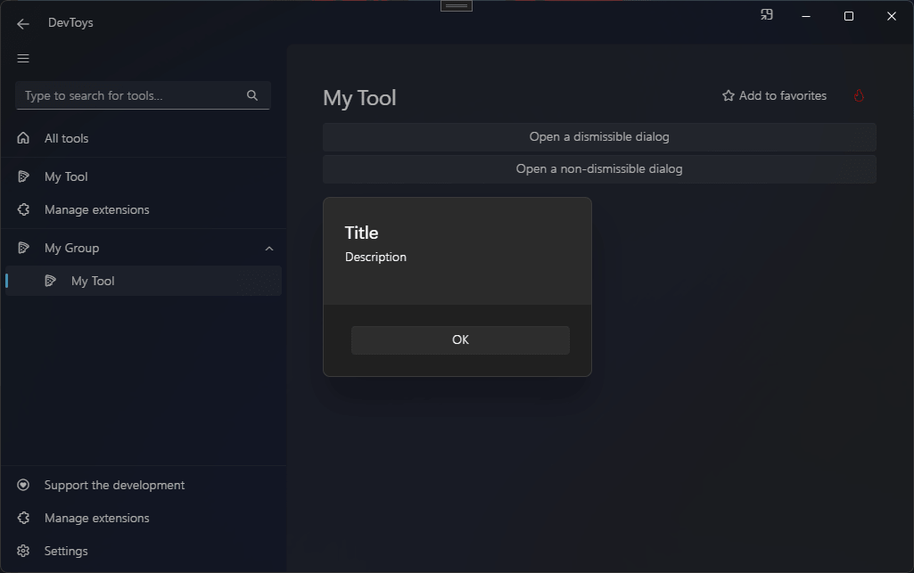

# Modal dialog

You can create a modal dialog using the @"DevToys.Api.UIToolView.OpenDialogAsync(DevToys.Api.IUIElement,DevToys.Api.IUIElement,System.Boolean)" method, which produces a @"DevToys.Api.UIDialog".

## Sample

```csharp
using DevToys.Api;
using System.ComponentModel.Composition;
using static DevToys.Api.GUI;

namespace MyProject;

[Export(typeof(IGuiTool))]
[Name("My Tool")]
[ToolDisplayInformation(
    IconFontName = "FluentSystemIcons",
    IconGlyph = '\uE670',
    ResourceManagerAssemblyIdentifier = nameof(MyResourceAssemblyIdentifier),
    ResourceManagerBaseName = "MyProject.Strings",
    ShortDisplayTitleResourceName = nameof(Strings.ShortDisplayTitle),
    DescriptionResourceName = nameof(Strings.Description),
    GroupName = "My Group")]
internal sealed class MyGuiTool : IGuiTool
{
    private readonly UIToolView _view = new UIToolView();

    public UIToolView View
    {
        get
        {
            if (_view.RootElement is null)
            {
                _view.WithRootElement(
                    Stack()
                        .Vertical()
                        .WithChildren(

                            Button()
                                .Text("Open a dismissible dialog")
                                .OnClick(OnOpenDismissibleDialogButtonClickAsync),

                            Button()
                                .Text("Open a non-dismissible dialog")
                                .OnClick(OnOpenNonDismissibleDialogButtonClickAsync)));
            }

            return _view;
        }
    }

    public void OnDataReceived(string dataTypeName, object? parsedData)
    {
        // Handle Smart Detection.
    }

    private async ValueTask OnOpenDismissibleDialogButtonClickAsync()
    {
        await OpenCustomDialogAsync(dismissible: true);
    }

    private async ValueTask OnOpenNonDismissibleDialogButtonClickAsync()
    {
        UIDialog dialog = await OpenCustomDialogAsync(dismissible: false);

        // (optional) Wait for the dialog to close before continuing.
        await dialog.DialogCloseAwaiter;

        // Do something after the dialog is closed.
    }

    private async Task<UIDialog> OpenCustomDialogAsync(bool dismissible)
    {
        // Open a dialog
        UIDialog dialog
            = await _view.OpenDialogAsync(
                dialogContent:
                    Stack()
                        .Vertical()
                        .WithChildren(
                            Label()
                                .Style(UILabelStyle.Subtitle)
                                .Text("Title"),
                            Label()
                                .Style(UILabelStyle.Body)
                                .Text("Description")),
                footerContent:
                    Button()
                        .AlignHorizontally(UIHorizontalAlignment.Right)
                        .Text("OK")
                        .OnClick(OnCloseDialogButtonClick),
                isDismissible: dismissible);

        void OnCloseDialogButtonClick()
        {
            // On click on OK button, close the dialog.
            _view.CurrentOpenedDialog?.Close();
        }

        return dialog;
    }
}
```

The code above produces the following UI:

