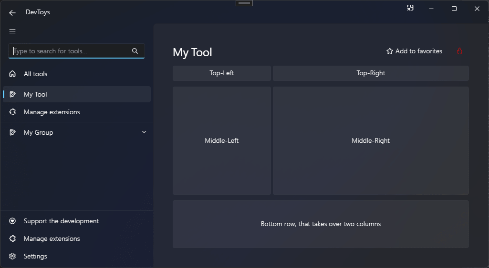

# Grid

You can create a grid using the @"DevToys.Api.GUI.Grid" static method, which produces a @"DevToys.Api.IUIGrid".

## Sample

```csharp
using DevToys.Api;
using System.ComponentModel.Composition;
using static DevToys.Api.GUI;

namespace MyProject;

[Export(typeof(IGuiTool))]
[Name("My Tool")]
[ToolDisplayInformation(
    IconFontName = "FluentSystemIcons",
    IconGlyph = '\uE670',
    ResourceManagerAssemblyIdentifier = nameof(MyResourceAssemblyIdentifier),
    ResourceManagerBaseName = "MyProject.Strings",
    ShortDisplayTitleResourceName = nameof(Strings.ShortDisplayTitle),
    DescriptionResourceName = nameof(Strings.Description),
    GroupName = "My Group")]
internal sealed class MyGuiTool : IGuiTool
{
    private enum GridRows
    {
        Top,
        Middle,
        Bottom
    }

    private enum GridColumns
    {
        Left,
        Right
    }

    public UIToolView View
        => new UIToolView(
            isScrollable: false,
            Grid()
                .ColumnSmallSpacing()
                .RowLargeSpacing()

                .Rows(
                    (GridRows.Top, Auto),                                              // Height automatically fits the content.
                    (GridRows.Middle, new UIGridLength(1, UIGridUnitType.Fraction)),   // Takes up the remaining space.
                    (GridRows.Bottom, new UIGridLength(100, UIGridUnitType.Pixel)))    // Takes up 100 pixels.

                .Columns(
                    (GridColumns.Left, new UIGridLength(1, UIGridUnitType.Fraction)),  // Takes up 1/3 of the space.
                    (GridColumns.Right, new UIGridLength(2, UIGridUnitType.Fraction))) // Takes up 2/3 of the space.

                .Cells(
                    Cell(GridRows.Top, GridColumns.Left,
                        Button().Text("Top-Left")),

                    Cell(GridRows.Top, GridColumns.Right,
                        Button().Text("Top-Right")),

                    Cell(GridRows.Middle, GridColumns.Left,
                        Button().Text("Middle-Left")),

                    Cell(GridRows.Middle, GridColumns.Right,
                        Button().Text("Middle-Right")),

                    Cell(
                        firstRow: GridRows.Bottom,
                        lastRow: GridRows.Bottom,
                        firstColumn: GridColumns.Left, // Make this cell spans on 2 columns.
                        lastColumn: GridColumns.Right,
                        Button().Text("Bottom row, that spans on two columns"))));

    public void OnDataReceived(string dataTypeName, object? parsedData)
    {
        // Handle Smart Detection.
    }
}
```

The code above produces the following UI:

