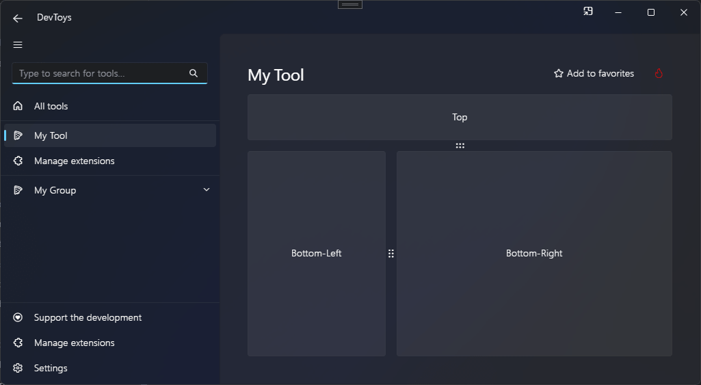

# Split Grid

You can create a resizeable grid using the @"DevToys.Api.GUI.SplitGrid" static method, which produces a @"DevToys.Api.IUISplitGrid".

## Sample

```csharp
using DevToys.Api;
using System.ComponentModel.Composition;
using static DevToys.Api.GUI;

namespace MyProject;

[Export(typeof(IGuiTool))]
[Name("My Tool")]
[ToolDisplayInformation(
    IconFontName = "FluentSystemIcons",
    IconGlyph = '\uE670',
    ResourceManagerAssemblyIdentifier = nameof(MyResourceAssemblyIdentifier),
    ResourceManagerBaseName = "MyProject.Strings",
    ShortDisplayTitleResourceName = nameof(Strings.ShortDisplayTitle),
    DescriptionResourceName = nameof(Strings.Description),
    GroupName = "My Group")]
internal sealed class MyGuiTool : IGuiTool
{
    public UIToolView View
        => new UIToolView(
            isScrollable: false,
            SplitGrid()
                .Horizontal()
                .TopPaneLength(new UIGridLength(1, UIGridUnitType.Fraction))
                .BottomPaneLength(new UIGridLength(300, UIGridUnitType.Pixel))
                .WithTopPaneChild(Button().Text("Top"))
                .WithBottomPaneChild(

                    SplitGrid()
                        .Vertical()
                        .LeftPaneLength(new UIGridLength(1, UIGridUnitType.Fraction))
                        .RightPaneLength(new UIGridLength(2, UIGridUnitType.Fraction))
                        .WithLeftPaneChild(Button().Text("Bottom-Left"))
                        .WithRightPaneChild(Button().Text("Bottom-Right"))));

    public void OnDataReceived(string dataTypeName, object? parsedData)
    {
        // Handle Smart Detection.
    }
}
```

The code above produces the following UI:

