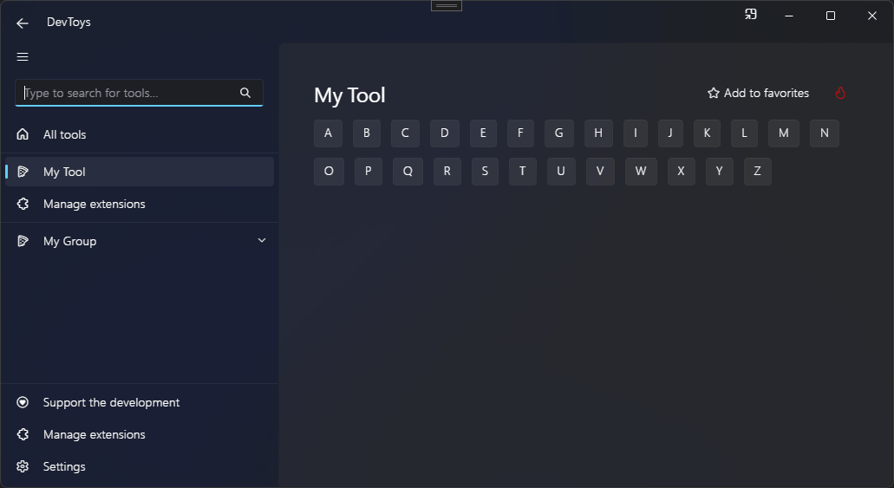

# Wrap

You can create a horizontal stack that wraps its content to a new line when needed using the @"DevToys.Api.GUI.Wrap" static method, which produces a @"DevToys.Api.IUIWrap".

## Sample

```csharp
using DevToys.Api;
using System.ComponentModel.Composition;
using static DevToys.Api.GUI;

namespace MyProject;

[Export(typeof(IGuiTool))]
[Name("My Tool")]
[ToolDisplayInformation(
    IconFontName = "FluentSystemIcons",
    IconGlyph = '\uE670',
    ResourceManagerAssemblyIdentifier = nameof(MyResourceAssemblyIdentifier),
    ResourceManagerBaseName = "MyProject.Strings",
    ShortDisplayTitleResourceName = nameof(Strings.ShortDisplayTitle),
    DescriptionResourceName = nameof(Strings.Description),
    GroupName = "My Group")]
internal sealed class MyGuiTool : IGuiTool
{
    public UIToolView View
        => new UIToolView(
            Stack()
                .Vertical()
                .WithChildren(
                    Wrap()
                        .LargeSpacing()
                        .WithChildren(
                            Button().Text("A"),
                            Button().Text("B"),
                            Button().Text("C"),
                            Button().Text("D"),
                            Button().Text("E"),
                            Button().Text("F"),
                            Button().Text("G"),
                            Button().Text("H"),
                            Button().Text("I"),
                            Button().Text("J"),
                            Button().Text("K"),
                            Button().Text("L"),
                            Button().Text("M"),
                            Button().Text("N"),
                            Button().Text("O"),
                            Button().Text("P"),
                            Button().Text("Q"),
                            Button().Text("R"),
                            Button().Text("S"),
                            Button().Text("T"),
                            Button().Text("U"),
                            Button().Text("V"),
                            Button().Text("W"),
                            Button().Text("X"),
                            Button().Text("Y"),
                            Button().Text("Z"))));

    public void OnDataReceived(string dataTypeName, object? parsedData)
    {
        // Handle Smart Detection.
    }
}
```

The code above produces the following UI:

