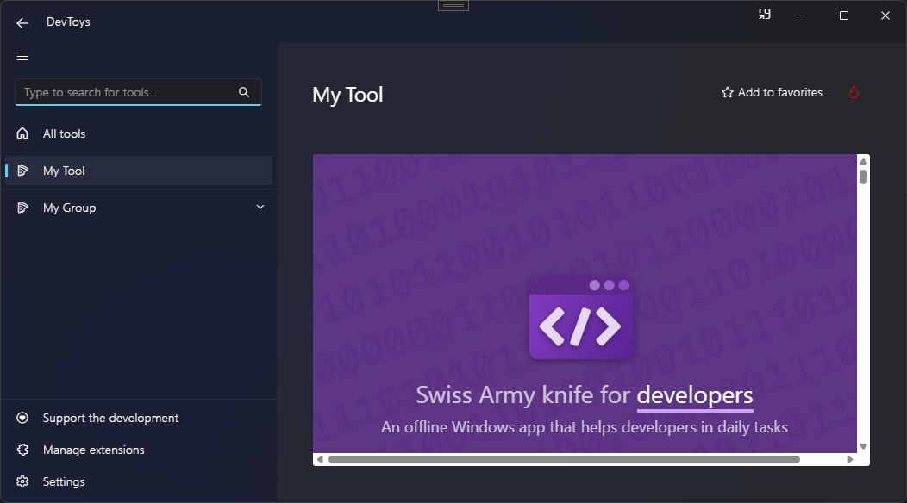

# Web View

You can create a web view using the @"DevToys.Api.GUI.WebView" static method, which produces a @"DevToys.Api.IUIWebView".

>[!IMPORTANT]
>DevToys UI is made using web technology. Most of the UI is in fact a web page, using HTML and CSS. The `WebView` UI component is therefore, in fact, an [iframe](https://www.w3schools.com/tags/tag_iframe.ASP).
>On **Windows**, the UI is rendered with the built-in [Microsoft Edge WebView2](https://learn.microsoft.com/en-us/microsoft-edge/webview2/), based on [Chromium](https://www.chromium.org/Home/). On **macOS** and **Linux**, the UI is rendered with the built-in [WebKit](https://webkit.org/).

## Sample

```csharp
using DevToys.Api;
using System.ComponentModel.Composition;
using static DevToys.Api.GUI;

namespace MyProject;

[Export(typeof(IGuiTool))]
[Name("My Tool")]
[ToolDisplayInformation(
    IconFontName = "FluentSystemIcons",
    IconGlyph = '\uE670',
    ResourceManagerAssemblyIdentifier = nameof(MyResourceAssemblyIdentifier),
    ResourceManagerBaseName = "MyProject.Strings",
    ShortDisplayTitleResourceName = nameof(Strings.ShortDisplayTitle),
    DescriptionResourceName = nameof(Strings.Description),
    GroupName = "My Group")]
internal sealed class MyGuiTool : IGuiTool
{
    public UIToolView View
        => new UIToolView(
            WebView()
                .NavigateToUri(new Uri("https://devtoys.app/")));

    public void OnDataReceived(string dataTypeName, object? parsedData)
    {
        // Handle Smart Detection.
    }
}
```

The code above produces the following UI:

