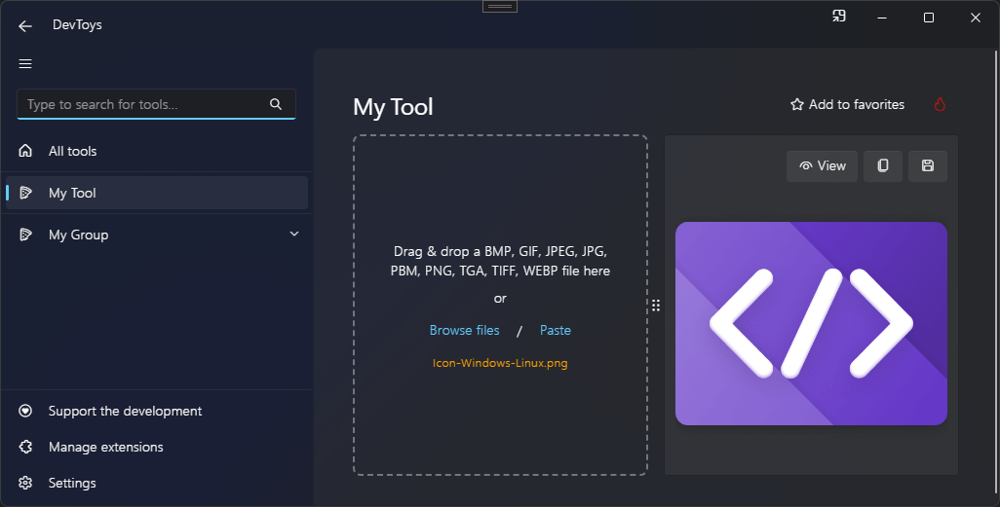

# Image Viewer

You can display an image and let the user copy or save it using the @"DevToys.Api.GUI.ImageViewer" static method, which produces a @"DevToys.Api.IUIImageViewer".

## Sample

```csharp
using DevToys.Api;
using System.ComponentModel.Composition;
using static DevToys.Api.GUI;

namespace MyProject;

[Export(typeof(IGuiTool))]
[Name("My Tool")]
[ToolDisplayInformation(
    IconFontName = "FluentSystemIcons",
    IconGlyph = '\uE670',
    ResourceManagerAssemblyIdentifier = nameof(MyResourceAssemblyIdentifier),
    ResourceManagerBaseName = "MyProject.Strings",
    ShortDisplayTitleResourceName = nameof(Strings.ShortDisplayTitle),
    DescriptionResourceName = nameof(Strings.Description),
    GroupName = "My Group")]
internal sealed class MyGuiTool : IGuiTool
{
    private IUIImageViewer _imageViewer = ImageViewer();

    public UIToolView View
        => new UIToolView(
            SplitGrid()
                .Vertical()

                .WithLeftPaneChild(
                    FileSelector()
                        .LimitFileTypesToImages()
                        .OnFilesSelected(OnFileSelected))

                .WithRightPaneChild(
                    _imageViewer
                        .ManuallyHandleSaveAs(".heic", OnSaveAsHeicAsync)));

    public void OnDataReceived(string dataTypeName, object? parsedData)
    {
        // Handle Smart Detection.
    }

    private void OnFileSelected(SandboxedFileReader[] files)
    {
        _imageViewer
            .WithPickedFile(files[0], disposeAutomatically: true);
    }

    private ValueTask OnSaveAsHeicAsync(FileStream destinationStream)
    {
        // Save the image as HEIC.
        return ValueTask.CompletedTask;
    }
}
```

The code above produces the following UI:

