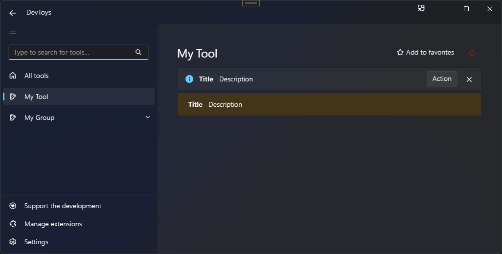

# Info Bar

You can display an information bar using the @"DevToys.Api.GUI.InfoBar" static method, which produces a @"DevToys.Api.IUIInfoBar".

## Sample

```csharp
using DevToys.Api;
using System.ComponentModel.Composition;
using static DevToys.Api.GUI;

namespace MyProject;

[Export(typeof(IGuiTool))]
[Name("My Tool")]
[ToolDisplayInformation(
    IconFontName = "FluentSystemIcons",
    IconGlyph = '\uE670',
    ResourceManagerAssemblyIdentifier = nameof(MyResourceAssemblyIdentifier),
    ResourceManagerBaseName = "MyProject.Strings",
    ShortDisplayTitleResourceName = nameof(Strings.ShortDisplayTitle),
    DescriptionResourceName = nameof(Strings.Description),
    GroupName = "My Group")]
internal sealed class MyGuiTool : IGuiTool
{
    private IUIInfoBar _infoBar = InfoBar();

    public UIToolView View
        => new UIToolView(
            Stack()
                .Vertical()
                .WithChildren(

                    _infoBar
                        .Title("Title")
                        .Description("Description")
                        .Informational()
                        .ShowIcon()
                        .Closable()
                        .WithActionButton("Action", isAccent: false, OnActionButtonClick)
                        .Open(),

                    InfoBar()
                        .Title("Title")
                        .Description("Description")
                        .Warning()
                        .HideIcon()
                        .NonClosable()
                        .Open()));

    public void OnDataReceived(string dataTypeName, object? parsedData)
    {
        // Handle Smart Detection.
    }

    private void OnActionButtonClick()
    {
        // [...]
        _infoBar.Close();
    }
}
```

The code above produces the following UI:

