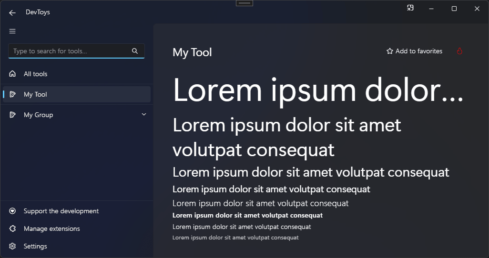

# Label

You can display a text using the @"DevToys.Api.GUI.Label" static method, which produces a @"DevToys.Api.IUILabel".

## Sample

```csharp
using DevToys.Api;
using System.ComponentModel.Composition;
using static DevToys.Api.GUI;

namespace MyProject;

[Export(typeof(IGuiTool))]
[Name("My Tool")]
[ToolDisplayInformation(
    IconFontName = "FluentSystemIcons",
    IconGlyph = '\uE670',
    ResourceManagerAssemblyIdentifier = nameof(MyResourceAssemblyIdentifier),
    ResourceManagerBaseName = "MyProject.Strings",
    ShortDisplayTitleResourceName = nameof(Strings.ShortDisplayTitle),
    DescriptionResourceName = nameof(Strings.Description),
    GroupName = "My Group")]
internal sealed class MyGuiTool : IGuiTool
{
    public UIToolView View
        => new UIToolView(
            Stack()
                .Vertical()
                .WithChildren(

                    Label()
                        .Style(UILabelStyle.Display)
                        .NeverWrap()
                        .Text("Lorem ipsum dolor sit amet volutpat consequat"),

                    Label()
                        .Style(UILabelStyle.TitleLarge)
                        .WrapIfNeeded()
                        .Text("Lorem ipsum dolor sit amet volutpat consequat"),

                    Label()
                        .Style(UILabelStyle.Title)
                        .Text("Lorem ipsum dolor sit amet volutpat consequat"),

                    Label()
                        .Style(UILabelStyle.Subtitle)
                        .Text("Lorem ipsum dolor sit amet volutpat consequat"),

                    Label()
                        .Style(UILabelStyle.BodyLarge)
                        .Text("Lorem ipsum dolor sit amet volutpat consequat"),

                    Label()
                        .Style(UILabelStyle.BodyStrong)
                        .Text("Lorem ipsum dolor sit amet volutpat consequat"),

                    Label()
                        .Style(UILabelStyle.Body)
                        .Text("Lorem ipsum dolor sit amet volutpat consequat"),

                    Label()
                        .Style(UILabelStyle.Caption)
                        .Text("Lorem ipsum dolor sit amet volutpat consequat")));

    public void OnDataReceived(string dataTypeName, object? parsedData)
    {
        // Handle Smart Detection.
    }
}
```

The code above produces the following UI:

