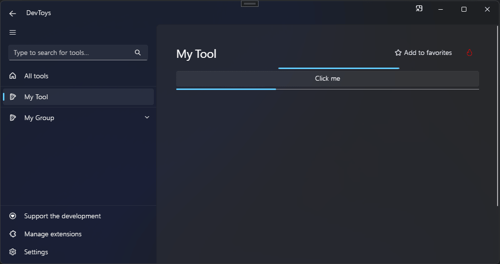

# Progress Bar

You can display a progress bar using the @"DevToys.Api.GUI.ProgressBar" static method, which produces a @"DevToys.Api.IUIProgressBar".

## Sample

```csharp
using DevToys.Api;
using System.ComponentModel.Composition;
using static DevToys.Api.GUI;

namespace MyProject;

[Export(typeof(IGuiTool))]
[Name("My Tool")]
[ToolDisplayInformation(
    IconFontName = "FluentSystemIcons",
    IconGlyph = '\uE670',
    ResourceManagerAssemblyIdentifier = nameof(MyResourceAssemblyIdentifier),
    ResourceManagerBaseName = "MyProject.Strings",
    ShortDisplayTitleResourceName = nameof(Strings.ShortDisplayTitle),
    DescriptionResourceName = nameof(Strings.Description),
    GroupName = "My Group")]
internal sealed class MyGuiTool : IGuiTool
{
    private readonly IUIProgressBar _progressBar = ProgressBar();

    public UIToolView View
        => new UIToolView(
            Stack()
                .Vertical()
                .WithChildren(

                    ProgressBar()
                        .StartIndeterminateProgress(),
                    
                    Button()
                        .Text("Click me")
                        .OnClick(OnButtonClickAsync),

                    _progressBar));

    public void OnDataReceived(string dataTypeName, object? parsedData)
    {
        // Handle Smart Detection.
    }

    private async ValueTask OnButtonClickAsync()
    {
        for (int i = 0; i <= 100; i++)
        {
            _progressBar.ProgressAsync(i).Forget();
            await Task.Delay(25);
        }
    }
}
```

The code above produces the following UI:

