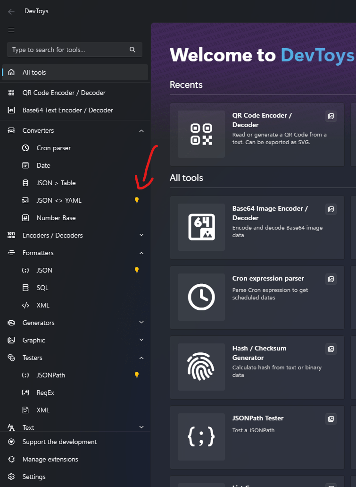
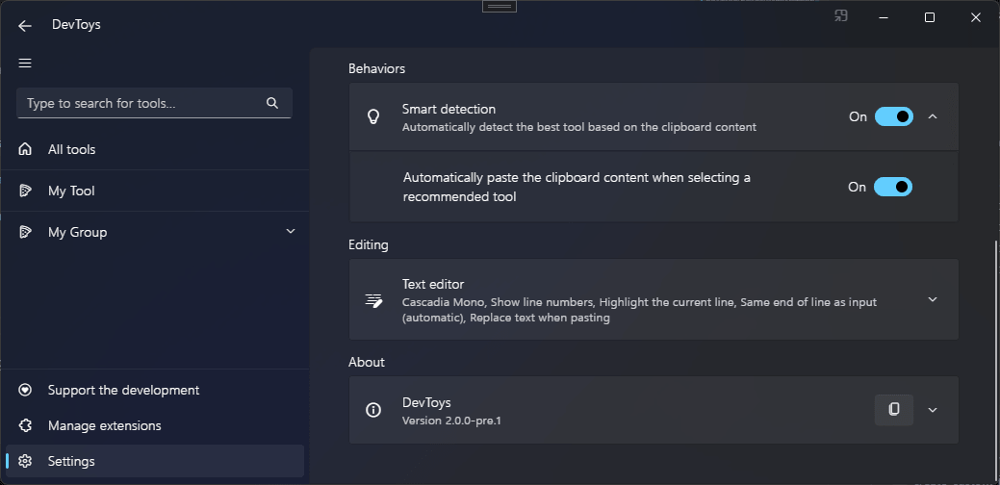

# Support Smart Detection

## Overview

DevToys introduces a feature known as Smart Detection. This feature analyzes the content of the user's clipboard and identifies the most suitable tools for the data. For instance, if the clipboard contains JSON text, DevToys will suggest all tools that accept JSON as input, such as the JSON Formatter.

Suggested tools are highlighted in the navigation bar with a light bulb icon.


Selecting a suggested tool will automatically paste the clipboard content into the tool for use as input.


Additionally, some tools have an embedded light bulb icon next to a read-only text box. This allows the user to transfer the output of one tool to another, enabling chained operations. For example, formatting a JSON, converting it to Base64 text, and then encoding it as a QR Code.


## Settings

User can enable or disable `Smart Detection` in the app settings.



## How it works

DevToys tools that implement @"DevToys.Api.IGuiTool" can register for specific data types that the app will detect via the clipboard or a read-only text box from a tool. For example, a tool can request to be highlighted when a simple text, JSON, XML, image, file, or other data type is detected.

DevToys identifies data types through @"DevToys.Api.IDataTypeDetector". A data type detector is a component that takes raw data as input, attempts to parse it (either partially or fully), and returns whether it matches the expected format.

## Predefined Data Types

A set of predefined data types are available in @"DevToys.Api.PredefinedCommonDataTypeNames". The @"DevToys.Api.IDataTypeDetector" for these data types are built into DevToys, so there's no need to implement the detectors yourself.

## Implementing a Data Type Detector

In the following example, we'll create a simple `HTML` file detector.

```csharp
using DevToys.Api;
using System.ComponentModel.Composition;

namespace MyProject;

[Export(typeof(IDataTypeDetector))]
[DataTypeName(HtmlDataTypeName, baseName: PredefinedCommonDataTypeNames.File)]
internal sealed partial class HtmlDataTypeDetector : IDataTypeDetector
{
    internal const string HtmlDataTypeName = "HTML File";

    public ValueTask<DataDetectionResult> TryDetectDataAsync(object data, DataDetectionResult? resultFromBaseDetector, CancellationToken cancellationToken)
    {
        if (resultFromBaseDetector is not null
            && resultFromBaseDetector.Data is FileInfo dataFile)
        {
            if (string.Equals(dataFile.Extension, ".html", StringComparison.CurrentCultureIgnoreCase)
                || string.Equals(dataFile.Extension, ".htm", StringComparison.CurrentCultureIgnoreCase))
            {
                // A detector has 2 seconds to run or it gets cancelled.
                cancellationToken.ThrowIfCancellationRequested();

                // [..] Implement more detection logic here if necessary
                return ValueTask.FromResult(new DataDetectionResult(Success: true, Data: dataFile));
            }
        }

        // We did not detected the data we are interested in.
        return ValueTask.FromResult(DataDetectionResult.Unsuccessful);
    }
}
```

The @"DevToys.Api.DataTypeNameAttribute" defines the name of the data type our detector is identifying, along with the data type it inherits from.

### Data Type inheritence

Data types can inherit from others. When applying inheritance using the @"DevToys.Api.DataTypeNameAttribute.DataTypeBaseName" property, data type detectors are invoked in a logical order.


In our `HTML file` detector example, assuming the user has a single file copied to the clipboard, the [Text](https://github.com/DevToys-app/DevToys/blob/9213efbbdd576b1ea28debba8574a26cb581ab18/src/app/dev/DevToys.Blazor/BuiltInDataTypeDetectors/TextDataTypeDetector.cs), [Image](https://github.com/DevToys-app/DevToys/blob/9213efbbdd576b1ea28debba8574a26cb581ab18/src/app/dev/DevToys.Blazor/BuiltInDataTypeDetectors/ImageDataTypeDetector.cs) and [Files](https://github.com/DevToys-app/DevToys/blob/9213efbbdd576b1ea28debba8574a26cb581ab18/src/app/dev/DevToys.Blazor/BuiltInDataTypeDetectors/FilesDataTypeDetector.cs) detectors will be invoked concurrently. We expect only the `Files detector` to find valid data, i.e., one or more files in the clipboard. The `Files detector` will return a @"DevToys.Api.DataDetectionResult" containing a strongly typed list of files, represented as an array of @"System.IO.FileInfo".

The resulting `DataDetectionResult` will be passed to the inheriting detector (the [File detector](https://github.com/DevToys-app/DevToys/blob/9213efbbdd576b1ea28debba8574a26cb581ab18/src/app/dev/DevToys.Blazor/BuiltInDataTypeDetectors/FileDataTypeDetector.cs)), via its `resultFromBaseDetector` parameter. This detector will use this parameter to check [if the clipboard contains a single file](https://github.com/DevToys-app/DevToys/blob/9213efbbdd576b1ea28debba8574a26cb581ab18/src/app/dev/DevToys.Blazor/BuiltInDataTypeDetectors/FileDataTypeDetector.cs#L10-L11). If succeeded, it will return a new @"DevToys.Api.DataDetectionResult" with a single @"System.IO.FileInfo".

Finally, our `HTML File` detector and the [Image File](https://github.com/DevToys-app/DevToys/blob/9213efbbdd576b1ea28debba8574a26cb581ab18/src/app/dev/DevToys.Blazor/BuiltInDataTypeDetectors/ImageFileDataTypeDetector.cs) will be invoked concurrently. Assuming the `HTML File` detector finds the **_HTML_** file in the clipboard, DevToys will suggest all tools that declare support for the HTML File data type by displaying a light bulb icon next to them.

### Do & Don't

- **DO** perform a quick and lightweight detection. Smart Detection is time-sensitive.
- **DO** assume that clipboard data can be large, so try to bail out as soon as possible.
- **DO** regularly check the `CancellationToken`. It cancels within 2 seconds.
- **DO** check the size of a file before attempting to read it, and bail out if the file is large. Large files may cause the detector to allocate a lot of memory and slow down the file analysis.
- **DO NOT** attempt to circumvent when Smart Detection is disabled through the app settings. Respect the user's choice.
- **DO NOT** create cycling inheritance.
- **DO NOT** create a data type detector that detects multiple data types that are vastly different from each other. Instead, create multiple data type detectors, one for each data type.

## Handling Smart Detection in a GUI tool

Now that we created a data type detector, we can make our tool supporting it.
Simply add the @"DevToys.Api.AcceptedDataTypeNameAttribute" to your tool's class and implement @"DevToys.Api.IGuiTool.OnDataReceived(System.String,System.Object)"

```csharp
using DevToys.Api;
using System.ComponentModel.Composition;
using static DevToys.Api.GUI;

namespace MyProject;

[Export(typeof(IGuiTool))]
[Name("My Tool")]
[ToolDisplayInformation(
    IconFontName = "FluentSystemIcons",
    IconGlyph = '\uE670',
    ResourceManagerAssemblyIdentifier = nameof(MyResourceAssemblyIdentifier),
    ResourceManagerBaseName = "MyProject.Strings",
    ShortDisplayTitleResourceName = nameof(Strings.ShortDisplayTitle),
    DescriptionResourceName = nameof(Strings.Description),
    GroupName = "My Group")]
[AcceptedDataTypeName(HtmlDataTypeDetector.HtmlDataTypeName)] // This tool only accepts HTML files. But we can also accept multiple data types.
internal sealed class MyGuiTool : IGuiTool
{
    private readonly IUIMultiLineTextInput _readOnlyInput = MultiLineTextInput();

    public UIToolView View
        => new UIToolView(
            Stack()
                .Vertical()
                .WithChildren(
                    Label()
                        .Style(UILabelStyle.BodyLarge)
                        .Text("The text box below will be automatically filled with the content of the HTML file from the clipboard."),

                    _readOnlyInput));

    public void OnDataReceived(string dataTypeName, object? parsedData)
    {
        if (parsedData is FileInfo htmlFile)
        {
            _readOnlyInput.Text(File.ReadAllText(htmlFile.FullName));
        }
    }
}
```

If `Smart Detection` is enabled in the app settings, when running DevToys after copying a single **_HTML_** file to the clipboard, `My Tool` will be highlighted through a light bulb, and the clipboard content will be automatically inserted in the `_readOnlyInput` UI element when the user navigates to the tool.

