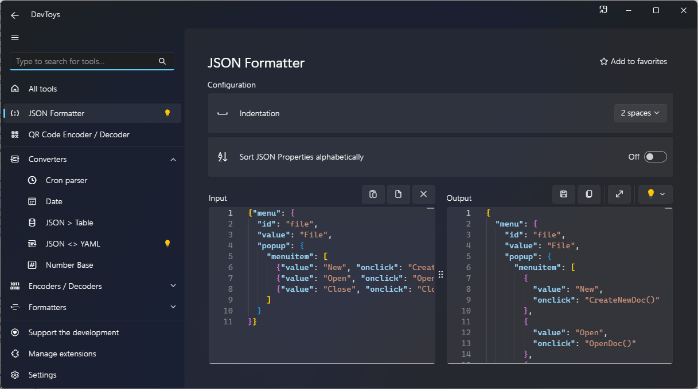

# Support Smart Detection

## Overview

DevToys comes up with a feature called Smart Detection. It reads the content of the user clipboard and try to find what are the best tools that fits the data. For example, if the clipboard's text is a JSON, DevToys will try to suggest all the tools that takes a JSON as an input, such as the JSON Formatter.

Suggested tools gets higlighted in the navigation bar with a light bulb icon.


Clicking on a suggested tool will paste automatically the content of the clipboard to the tool, so it can use it as an input.


Finally, some tools will also have an embedded light bulb next to a read-only text box that allows the user to transfer the output of a tool to another one. This allows user to do some chained operation, such as formatting a JSON, then converting it to a Base64 text, then encoding it as a QR Code.


## Settings

User can enable or disable `Smart Detection` in the app settings.


## How it works

DevToys tools implementing @"DevToys.Api.IGuiTool" can register to a certain type of data that will be detected by the app through the clipboard or a read-only text box from a tool. For example, a tool can request to be highlighted specifically when a simple text is detected, or a JSON, an XML, an image, a file, or else.

DevToys detects data types through @"DevToys.Api.IDataTypeDetector". A data type detector is a simple component that takes a raw data in input, tries to parse it partially or fully and returns whether it matches the expected format or not.

## Predefined Data Types

A set of pre-defined data types are available in @"DevToys.Api.PredefinedCommonDataTypeNames". The @"DevToys.Api.IDataTypeDetector" for these data types are built-in in DevToys, so you do not need to implement the detectors yourself.

## Implementing a Data Type Detector

In the example below, we will create a simple `HTML` file detector.

```csharp
using DevToys.Api;
using System.ComponentModel.Composition;

namespace MyProject;

[Export(typeof(IDataTypeDetector))]
[DataTypeName(HtmlDataTypeName, baseName: PredefinedCommonDataTypeNames.File)]
internal sealed partial class HtmlDataTypeDetector : IDataTypeDetector
{
    internal const string HtmlDataTypeName = "HTML File";

    public ValueTask<DataDetectionResult> TryDetectDataAsync(object data, DataDetectionResult? resultFromBaseDetector, CancellationToken cancellationToken)
    {
        if (resultFromBaseDetector is not null
            && resultFromBaseDetector.Data is FileInfo dataFile)
        {
            if (string.Equals(dataFile.Extension, ".html", StringComparison.CurrentCultureIgnoreCase)
                || string.Equals(dataFile.Extension, ".htm", StringComparison.CurrentCultureIgnoreCase))
            {
                // A detector has 2 seconds to run or it gets cancelled.
                cancellationToken.ThrowIfCancellationRequested();

                // [..] Implement more detection logic here if necessary
                return ValueTask.FromResult(new DataDetectionResult(Success: true, Data: dataFile));
            }
        }

        // We did not detected the data we are interested in.
        return ValueTask.FromResult(DataDetectionResult.Unsuccessful);
    }
}
```

The @"DevToys.Api.DataTypeNameAttribute" defines the name of the data type being detected by our detector, along with what data type it inherits from.

### Data Type inheritence

Data type can inherits from others. When applying inheritence using the @"DevToys.Api.DataTypeNameAttribute.DataTypeBaseName" property, data type detectors are invoked in a logical order.


In our example with an `HTML file` detector, assuming that the user has a single file copied in the clipboard, the [Text](https://github.com/DevToys-app/DevToys/blob/9213efbbdd576b1ea28debba8574a26cb581ab18/src/app/dev/DevToys.Blazor/BuiltInDataTypeDetectors/TextDataTypeDetector.cs), [Image](https://github.com/DevToys-app/DevToys/blob/9213efbbdd576b1ea28debba8574a26cb581ab18/src/app/dev/DevToys.Blazor/BuiltInDataTypeDetectors/ImageDataTypeDetector.cs) and [Files](https://github.com/DevToys-app/DevToys/blob/9213efbbdd576b1ea28debba8574a26cb581ab18/src/app/dev/DevToys.Blazor/BuiltInDataTypeDetectors/FilesDataTypeDetector.cs) detectors will be invoked in parallel. We expect that only the `Files detector` find a valid data, which is having one or many files in the clipboard. The `Files detector` will return a @"DevToys.Api.DataDetectionResult" that contains a strongly typed list of file, represented through an array of @"System.IO.FileInfo".

Continuing, the resulted `DataDetectionResult` will be passed to the inheriting detector, which is [File detector](https://github.com/DevToys-app/DevToys/blob/9213efbbdd576b1ea28debba8574a26cb581ab18/src/app/dev/DevToys.Blazor/BuiltInDataTypeDetectors/FileDataTypeDetector.cs), through its `resultFromBaseDetector` parameter. This detector will use this parameter to detect [whether the clipboard contains a single file](https://github.com/DevToys-app/DevToys/blob/9213efbbdd576b1ea28debba8574a26cb581ab18/src/app/dev/DevToys.Blazor/BuiltInDataTypeDetectors/FileDataTypeDetector.cs#L10-L11). If succeeded, it will then return a new @"DevToys.Api.DataDetectionResult" with a single @"System.IO.FileInfo".

Finally, our `HTML File` detector and the [Image File](https://github.com/DevToys-app/DevToys/blob/9213efbbdd576b1ea28debba8574a26cb581ab18/src/app/dev/DevToys.Blazor/BuiltInDataTypeDetectors/ImageFileDataTypeDetector.cs) detector will be invoked in parallel. Assuming that the `HTML File` detector finds the **_HTML_** file in the clipboard, DevToys will then suggest to the user every tools that declare supporting the `HTML File` data type by showing a light bulb next to them.

### Do & Don't

- **DO** perform a fast and lightweigh detection. Smart Detection is time sensitive.
- **DO** assume that data from the clipboard can be massive, so try to bail out as soon as possible.
- **DO** check on the `CancellationToken` regularly. It cancels within 2 seconds.
- **DO** check on the size of a file before attempting to read it, and bail out if the file is large, as the detector may allocate a lot of memory and be slow to analyze the file.
- **DO NOT** try to workaround when Smart Detection is disabled through the app settings. Respect the user's decision.
- **DO NOT** create cycling inheritance.
- **DO NOT** create a data type detector that detects multiple data types that are widly different from each other. Instead, create multiple data type detectors, one by data type.

## Handling Smart Detection in a GUI tool

Now that we created a data type detector, we can make our tool supporting it.
Simply add the @"DevToys.Api.AcceptedDataTypeNameAttribute" to your tool's class and implement @"DevToys.Api.IGuiTool.OnDataReceived(System.String,System.Object)"

```csharp
using DevToys.Api;
using System.ComponentModel.Composition;
using static DevToys.Api.GUI;

namespace MyProject;

[Export(typeof(IGuiTool))]
[Name("My Tool")]
[ToolDisplayInformation(
    IconFontName = "FluentSystemIcons",
    IconGlyph = '\uE670',
    ResourceManagerAssemblyIdentifier = nameof(MyResourceAssemblyIdentifier),
    ResourceManagerBaseName = "MyProject.Strings",
    ShortDisplayTitleResourceName = nameof(Strings.ShortDisplayTitle),
    DescriptionResourceName = nameof(Strings.Description),
    GroupName = "My Group")]
[AcceptedDataTypeName(HtmlDataTypeDetector.HtmlDataTypeName)] // This tool only accepts HTML files. But we can also accept multiple data types.
internal sealed class MyGuiTool : IGuiTool
{
    private readonly IUIMultiLineTextInput _readOnlyInput = MultiLineTextInput();

    public UIToolView View
        => new UIToolView(
            Stack()
                .Vertical()
                .WithChildren(
                    Label()
                        .Style(UILabelStyle.BodyLarge)
                        .Text("The text box below will be automatically filled with the content of the HTML file from the clipboard."),

                    _readOnlyInput));

    public void OnDataReceived(string dataTypeName, object? parsedData)
    {
        if (parsedData is FileInfo htmlFile)
        {
            _readOnlyInput.Text(File.ReadAllText(htmlFile.FullName));
        }
    }
}
```

If `Smart Detection` is enabled in the app settings, when running DevToys after copying a single **_HTML_** file to the clipboard, `My Tool` will be highlighted through a light bulb, and the clipboard content will be automatically inserted in the `_readOnlyInput` UI element when the user navigates to the tool.

