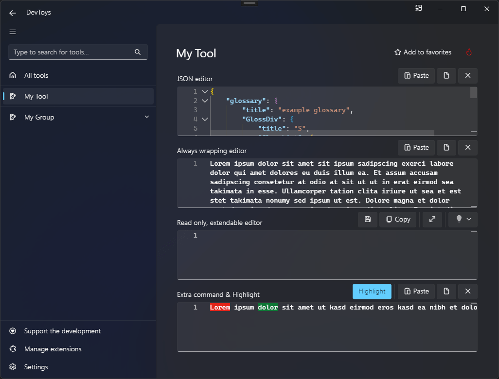

# Multiline Text Input

You can display a rich text editor with associated command bar using the @"DevToys.Api.GUI.MultiLineTextInput" static method, which produces a @"DevToys.Api.IUIMultiLineTextInput".

>[!NOTE]
>DevToys' `MultiLineTextInput` is powered by [Microsoft Monaco Editor](https://microsoft.github.io/monaco-editor/), which is the same code editor that powers [Microsoft Visual Studio Code](https://code.visualstudio.com/).

It is a powerful editor that comes with:
- Built-in syntax colorization of many languages such as JSON, XML, YAML, TypeScript. See [all supported languages](https://github.com/microsoft/monaco-editor/tree/main/src/basic-languages).
- Highlighting
- Tooltip
- Line numbers
- Wrapping
- And more to be supported in DevToys in the future...

## Sample

```csharp
using DevToys.Api;
using System.ComponentModel.Composition;
using static DevToys.Api.GUI;

namespace MyProject;

[Export(typeof(IGuiTool))]
[Name("My Tool")]
[ToolDisplayInformation(
    IconFontName = "FluentSystemIcons",
    IconGlyph = '\uE670',
    ResourceManagerAssemblyIdentifier = nameof(MyResourceAssemblyIdentifier),
    ResourceManagerBaseName = "MyProject.Strings",
    ShortDisplayTitleResourceName = nameof(Strings.ShortDisplayTitle),
    DescriptionResourceName = nameof(Strings.Description),
    GroupName = "My Group")]
internal sealed class MyGuiTool : IGuiTool
{
    private readonly IUIMultiLineTextInput _multiLineTextInput = MultiLineTextInput();

    public UIToolView View
        => new UIToolView(
            Stack()
                .Vertical()
                .WithChildren(

                    MultiLineTextInput()
                        .Title("JSON editor")
                        .Language("json"),

                    MultiLineTextInput()
                        .Title("Always wrapping editor")
                        .AlwaysWrap(),

                    MultiLineTextInput()
                        .Title("Read only, extendable editor")
                        .Extendable()
                        .ReadOnly(),

                    _multiLineTextInput
                        .Title("Extra command & Highlight")
                        .CommandBarExtraContent(
                            Button()
                                .Text("Highlight")
                                .AccentAppearance()
                                .OnClick(OnHighlightButtonClick))));

    public void OnDataReceived(string dataTypeName, object? parsedData)
    {
        // Handle Smart Detection.
    }

    private void OnHighlightButtonClick()
    {
        if (_multiLineTextInput.Text.Length > 20)
        {
            _multiLineTextInput.Highlight(
                new UIHighlightedTextSpan(0, 5, UIHighlightedTextSpanColor.Red),
                new UIHighlightedTextSpan(12, 5, UIHighlightedTextSpanColor.Green));
        }
    }
}
```

The code above produces the following UI:

