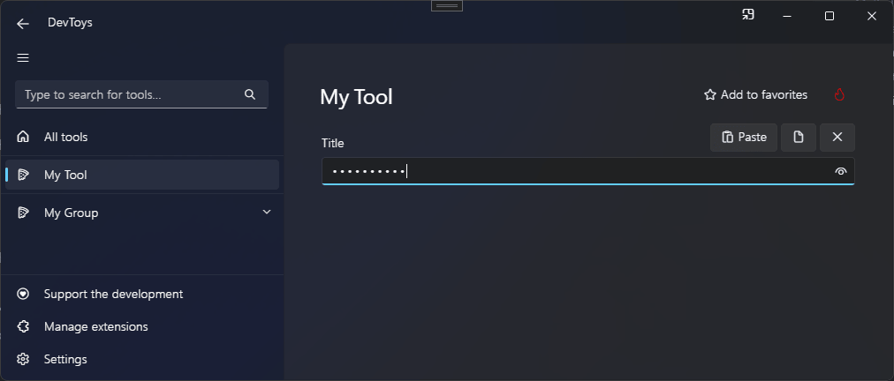

# Password Input

You can display a password input with associated command bar using the @"DevToys.Api.GUI.PasswordInput" static method, which produces a @"DevToys.Api.IUIPasswordInput".

## Sample

```csharp
using DevToys.Api;
using System.ComponentModel.Composition;
using static DevToys.Api.GUI;

namespace MyProject;

[Export(typeof(IGuiTool))]
[Name("My Tool")]
[ToolDisplayInformation(
    IconFontName = "FluentSystemIcons",
    IconGlyph = '\uE670',
    ResourceManagerAssemblyIdentifier = nameof(MyResourceAssemblyIdentifier),
    ResourceManagerBaseName = "MyProject.Strings",
    ShortDisplayTitleResourceName = nameof(Strings.ShortDisplayTitle),
    DescriptionResourceName = nameof(Strings.Description),
    GroupName = "My Group")]
internal sealed class MyGuiTool : IGuiTool
{
    private readonly IUIMultiLineTextInput _multiLineTextInput = MultiLineTextInput();

    public UIToolView View
        => new UIToolView(
            PasswordInput()
                .Title("Title")
                .OnTextChanged(OnPasswordChanged));

    public void OnDataReceived(string dataTypeName, object? parsedData)
    {
        // Handle Smart Detection.
    }

    private void OnPasswordChanged(string password)
    {
        // Handle password changed.
    }
}
```

The code above produces the following UI:


