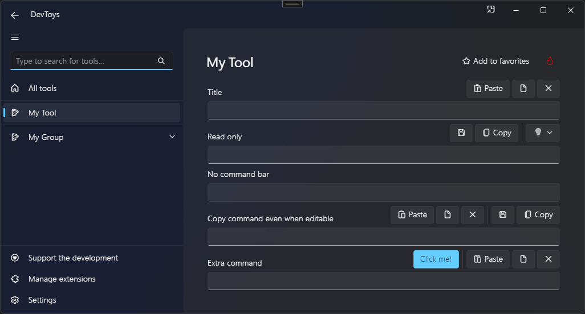

# Singleline Text Input

You can display a text input with associated command bar using the @"DevToys.Api.GUI.SingleLineTextInput" static method, which produces a @"DevToys.Api.IUISingleLineTextInput".

## Sample

```csharp
using DevToys.Api;
using System.ComponentModel.Composition;
using static DevToys.Api.GUI;

namespace MyProject;

[Export(typeof(IGuiTool))]
[Name("My Tool")]
[ToolDisplayInformation(
    IconFontName = "FluentSystemIcons",
    IconGlyph = '\uE670',
    ResourceManagerAssemblyIdentifier = nameof(MyResourceAssemblyIdentifier),
    ResourceManagerBaseName = "MyProject.Strings",
    ShortDisplayTitleResourceName = nameof(Strings.ShortDisplayTitle),
    DescriptionResourceName = nameof(Strings.Description),
    GroupName = "My Group")]
internal sealed class MyGuiTool : IGuiTool
{
    public UIToolView View
        => new UIToolView(
            Stack()
                .Vertical()
                .WithChildren(

                    SingleLineTextInput()
                        .Title("Title")
                        .OnTextChanged(OnSingleLineTextInputTextChanged),

                    SingleLineTextInput()
                        .Title("Read only")
                        .ReadOnly(),

                    SingleLineTextInput()
                        .Title("No command bar")
                        .HideCommandBar(),

                    SingleLineTextInput()
                        .Title("Copy command even when editable")
                        .CanCopyWhenEditable(),

                    SingleLineTextInput()
                        .Title("Extra command")
                        .CommandBarExtraContent(
                            Button()
                                .Text("Click me!")
                                .AccentAppearance())));

    public void OnDataReceived(string dataTypeName, object? parsedData)
    {
        // Handle Smart Detection.
    }

    private void OnSingleLineTextInputTextChanged(string text)
    {
    }
}
```

The code above produces the following UI:

